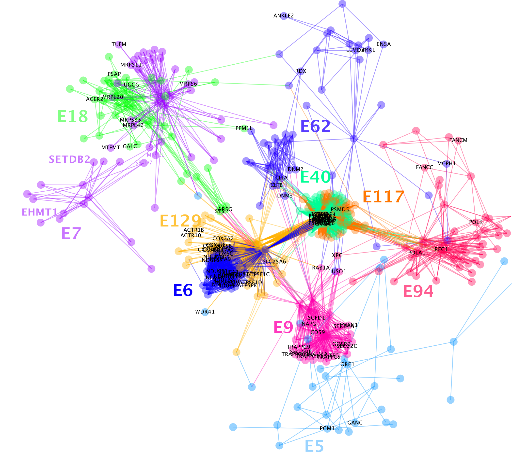
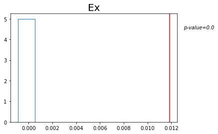

# *genecluster*


This code let's you do ...

---

### Quickstart

1. load dependencies


```python
import multiprocessing
import pandas as pd
import numpy as np
import matplotlib.pyplot as plt
import gseapy

from geneclusters.cluster_genes import score_for_thres, get_kernighan_lin_clusters
from geneclusters.prepare_inputs import get_gene_pathway_matrix
from geneclusters.compute_stats import compute_t, compute_permuted_t, return_correlation_matrix, return_permutation_inputs, run_permutations, compute_permutation_p
from geneclusters.plotting import plot_permutations

cpu = multiprocessing.cpu_count()
pool = multiprocessing.Pool(cpu-1)
```

2. download the pathway source on which you'd like to cluster


```python
# run with internet
x = gseapy.get_library('WikiPathway_2021_Human')
np.save('WikiPathway_2021_Human.npy', x)
```

3. run kernighan-lin clustering algorithm 


```python
# assign the clusters
frame = get_kernighan_lin_clusters('./examples/WikiPathway_2021_Human.npy', threshold=50, C=.5)
frame.columns = ['cluster', 'description', 'is_gene']
frame.to_csv('kernighan_clusters.csv', index = False)
```

4. what the output looks like


```python
frame.head()
```

---

### Visualizing and interpreting clusters

----

### Benchmarking against other packages


```python
# evaluate observed correlations against Null
frame = pd.read_csv('kernighan_clusters.csv')
Nperm = 5

for name in np.array(['Ex']):#, 'In', 'Mic', 'Ast', 'Oli', 'Opc']):
    print('** '+name+' **')
    permuted_t, observed_t = run_permutations('./examples/' + name +'.csv', frame, Nperm)
    p = compute_permutation_p(permuted_t, observed_t)
    plot_permutations(permuted_t, observed_t, p, Nperm, name)
    plt.show()
```

    ** Ex **


      0%|          | 0/5 [00:00<?, ?it/s]




