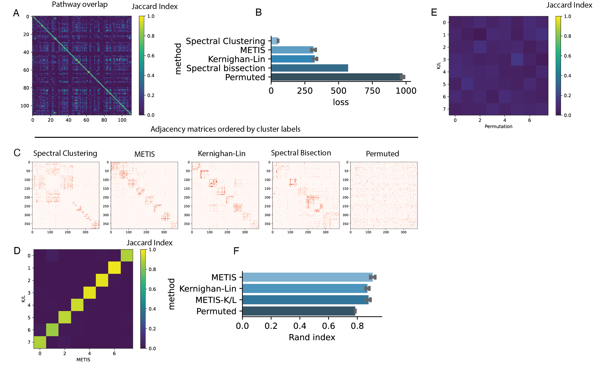

> [!WARNING]  
> **This repo is not open-source.** You may view and fork this project, but this work otherwise comes with no permissions. **You may not use, distribute, or modify any of the code that is part of this project.** We will make this project open-source upon publication of our paper in a peer-reviewed journal. For more info see [here](https://opensource.guide/legal/#are-public-github-projects-open-source). Thanks for your understanding!

The heatmap in Fig. S8A highlights how frequently pathways within a pathway database, such as WikiPathways, share gene members. On average, every pathway shown in Fig. S8A shares at least one gene with approximately 40% of the other pathways, highlighting that there is plenty of redundancy in this matrix that could be summarized in simpler terms. 
To summarize redundant gene-pathway information as a limited number of non-redundant gene-pathway groups, we reformulated the gene-pathway association problem as a bipartite graph G constructed from all the genes in the Leading Edge subset (LE) and their associated pathways. LE was defined as the set of 268 genes driving the enrichment signal for pathways that passed a significance threshold of p<0.05 (FGSEA) in Con vs ABCA7 LoF excitatory neurons. G was constructed from an n x m unweighted adjacency matrix, where n represented the number of LE genes and m the number of pathways associated with four or more LE genes, as specified in the WikiPathway database.
Graph partitioning involves segmenting the vertices of a graph into equal-sized partitions, optimizing for the minimal number of interconnecting edges (i.e. “total cut size”). We tested three prominent graph partitioning techniques, as outlined by Elsner (1997) (21), to approximate optimal partitioning. These methods include:
Recursive Spectral Bisection: Implemented in Python using the numpy linear algebra package, this method was executed for log2(N) iterations, yielding N = 8 partitions. A detailed description of the algorithm can be found in (21).
Multilevel Graph Partitioning: Leveraging the METIS software package (22) in Python using the following parameters: nparts=8, tpwgts=None, ubvec=None, recursive=False.
Kernighan-Lin (K/L) Algorithm: Based on its original paper (14), this algorithm was implemented in Python and run with parameters set as C=0, KL_modified=True, random_labels=True, unweighted=True, and K=50.
Additionally, the Spectral Clustering algorithm, a commonly used clustering method, was applied using the SpectralClustering() function from the sklearn Python package with default parameters, apart from n_clusters = 8 and assign_labels = 'kmeans'. We stipulated eight clusters for each algorithm, as qualitatively, this resolution seemed to strike a good balance to summarize main biological effects.
For benchmarking purposes, the three graph partitioning techniques and the spectral clustering algorithm were evaluated by segmenting graph G into eight gene-pathway clusters using the respective algorithms. Spectral clustering was run over 1,000 initiations, while K/L and Metis were run over 50,000 iterations because their solutions were slightly more variable across runs. The deterministic bisection method was run only once. A randomized graph partitioning benchmark was also computed by permuting the eight cluster labels of approximately equivalent size for 1,000 initiations. Average losses were computed per algorithm on all initiations. 

Results
Spectral clustering performed significantly better to all other algorithms based on the loss (Fig. S8B). This was to be expected, as spectral clustering does not place a constraint on cluster size. Spectral clustering results were characterized by a single large cluster and many small clusters (Fig. S8C), indicating that this clustering algorithm was highly susceptible to outliers and suggesting that graph partitioning, which imposes the constraint of equal partitioning, was a better approach to the problem of grouping genes and pathways into biologically informative groups. Indeed, all three graph partitioning algorithms divided the graph into more uniformly-sized groups (Fig. S8C). Among the partitioning algorithms, K/L and METIS produced the most uniformly sized groups (Fig. S8C) and also had significantly lower losses compared to the spectral bisection algorithm (Fig. S8B). K/L and METIS solutions were very similar, with their respective best solutions (lowest loss) having an average Jaccard similarity index of 0.91 on the diagonal (Fig. S8D,E). K/L and METIS solutions were also consistent across pairwise random initiations, both when comparing within K/L or METIS solutions (RI:Rand Index=0.87 and 0.91, respectively) and when comparing all pairwise K/L and METIS solutions (RI=0.88).
Overall, these results indicate the importance for non-redundant gene-pathway groupings to interpret biological effects. They also indicate that for some gene-pathway graphs, such as the one in this study, graph partitioning is a better approach than clustering. 

<div style="text-align: center;">

</div>

<div style="width: 100%;margin: 0 auto; text-align: left"> <!-- Change the percentage as needed -->
    <p>
        <strong>Benchmarking partitioning and clustering algorithms for gene-pathway grouping.</strong> 
        <strong>(A)</strong> Jaccard indices quantifying overlap of genes for all 111 pathways in graph G (see Methods; Supplementary Text). 
        <strong>(B)</strong> Average loss (total cut size; see Methods) associated with applying each algorithm (spectral clustering (SC), METIS, Kernighan-Lin (K/L), spectral bisection (SB), or random permutation) to G (with 379 vertices; see Methods) over 1000 initiations (SC, random permutation) or 5x10e5 initiations (METIS, K/L). The SB implementation is deterministic and was run only once. Error bars indicate the standard deviation. 
        <strong>(C)</strong> Unweighted adjacency matrix for G sorted by labels assigned by indicated algorithm. Red indicates the presence of an edge between two vertices. For each algorithm, labels corresponding to the best initiation (lowest loss) over 1000 initiations (SC, random permutation) or 5x10e5 initiations (METIS, K/L) are shown. 
        <strong>(D)</strong> Pairwise labeling consistency for the best K/L initiation and the best METIS initiation. Cluster labels corresponding to each are shown on the X- and Y-axes, respectively. Each color entry indicates the fraction of shared vertices per cluster across two initiations. Consistency is quantified using the Jaccard Index (JI). JI=|A∩B|/|A∪B|, where A and B are two sets (i.e., cluster A from initiation #1 and cluster B from initiation#2). 
        <strong>(E)</strong> Same as (D), but comparing best K/L initiation against the best random permutation initiation. 
        <strong>(F)</strong> Average Rand index (RI) for all pairwise initiations from (B). “METIS”, “Kernighan-Lin”, and “Permuted” labels on the Y-axis indicate the average RI (consistency across two sets of labels) for all combinations of initiations within the specified algorithm. “METIS-K/L” indicates the average RI for all combinations of initiations across the METIS and Kernighan-Lin algorithms. Error bars indicate standard deviations. (RI = (# of agreeing vertex pairs) / (# of vertex pairs)).
    </p>
</div>


### Kernighan-Lin Heuristic
This code implements the Kernighan-Lin algorithm, described [here](https://ieeexplore.ieee.org/document/6771089), to partition a bipartite graph (weighted or unweighted edges) into a number of specified partitions, with the objective of minimizing the (weighted) sum of edges crossing partitions. 


### Other Sources: 
[CMU](https://www.cs.cmu.edu/~ckingsf/bioinfo-lectures/kernlin.pdf)\
[Wikipedia](https://en.wikipedia.org/wiki/Kernighan%E2%80%93Lin_algorithm)


### Example run


1. load dependencies


```python
import numpy as np
import gseapy
from scipy.sparse import csr_matrix
from tqdm.contrib.concurrent import process_map
from functools import partial
from scipy.sparse.csgraph import shortest_path
import matplotlib.pyplot as plt
import seaborn as sns

from geneclusters.cluster_genes_new import get_scores, get_kernighan_lin_clusters, get_gene_pathway_matrix, get_full_matrix_from_bipartite
```

2. Download pathway database(s)


```python
# run with internet
gseapy.get_library_name() # to show library names
x = gseapy.get_library('HumanCyc_2016')
np.save('HumanCyc_2016.npy', x)
```

3. Iterate over multiple initiations


```python
help(get_kernighan_lin_clusters)
```

    Help on function get_kernighan_lin_clusters in module geneclusters.cluster_genes_new:
    
    get_kernighan_lin_clusters(path, threshold, C, KL_modified=True, random_labels=True, unweighted=True, seed=5)
        returns pandas dataframe annotating each gene and pathway to a cluster, based on pathway-gene dictionary and args
        Args:
            path str
                path to pathway-gene dictionary as ndarray
            threshold int
                if random_labels is True, gives number of genes per cluster. Min = 1, Max = total number of genes and pathways
                if random_labels is False, gives number of desired clusters. Min = 1, Max = total number of genes and pathways
            C float
                probability of false negative pathway-gene association (0<=c<= 1)
            KL_modified bool
                whether to run the modified KL algorithm 
            random_labels
                whether to randomize initiating labels or assign based on node centrality
            unweighted bool
                whether to consider weights when computing the shortest path between nodes, only considiered if random_labels is False
    


```python
path = './examples/HumanCyc_2016.npy'
repeats = 500

thresh = np.repeat(30,repeats)
seed = np.arange(repeats)
C = 0
KL_modified = True
random_labels = True
unweighted = True

results = process_map(partial(get_scores,path,C,KL_modified,random_labels,unweighted), seed, thresh)

```


      0%|          | 0/500 [00:00<?, ?it/s]


    3it [00:06,  2.06s/it, tot_impr=1444, last_impr=0, loss=410] ] 
    3it [00:06,  2.17s/it, tot_impr=1499, last_impr=0, loss=361]   
    3it [00:06,  2.19s/it, tot_impr=1455, last_impr=0, loss=388] 
    3it [00:06,  2.19s/it, tot_impr=1441, last_impr=0, loss=410] 
    3it [00:06,  2.21s/it, tot_impr=1443, last_impr=0, loss=395] 
    3it [00:06,  2.21s/it, tot_impr=1467, last_impr=0, loss=390]  
    4it [00:06,  1.67s/it, tot_impr=1414, last_impr=0, loss=425]
    4it [00:06,  1.67s/it, tot_impr=1435, last_impr=0, loss=423]
    4it [00:06,  1.69s/it, tot_impr=1454, last_impr=0, loss=393]
    ...

4. Select labels from the best loss


```python
loss = np.hstack([x[1] for x in results])
labs = np.vstack([x[0] for x in results])
labels = labs[np.argmin(loss)]
```


```python
# assign the clusters
frame, loss_temp = get_kernighan_lin_clusters(path, 30, C, KL_modified, random_labels, unweighted, seed=seed[np.argmin(loss)])
frame.columns = ['cluster', 'description', 'is_gene']

```

    6it [00:06,  1.15s/it, tot_impr=1509, last_impr=0, loss=349]   


```python
frame[frame['cluster']==23]['description']
```


    11                                                 ACAD8
    13                                                ACADSB
    90                                               ALDH6A1
    135                                                  AUH
    147                                                BCAT1
    148                                                BCAT2
    149                                               BCKDHA
    150                                               BCKDHB
    243                                                  DBT
    261                                                  DLD
    277                                                ECHS1
    426                                                HADHA
    434                                               HIBADH
    435                                                HIBCH
    442                                              HMGCLL1
    461                                             HSD17B10
    509                                                  IVD
    543                                                MCCC1
    544                                                MCCC2
    624                                                PDHA1
    625                                                PDHA2
    796                                                  SDS
    797                                                 SDSL
    972    pyruvate decarboxylation to acetyl CoA Homo sa...
    974     2-oxobutanoate degradation Homo sapiens PWY-5130
    975         threonine degradation Homo sapiens PWY66-428
    976        leucine degradation Homo sapiens LEU-DEG2-PWY
    977      isoleucine degradation Homo sapiens ILEUDEG-PWY
    978           valine degradation Homo sapiens VALDEG-PWY
    Name: description, dtype: object


5. Order matrix entries by labeling


```python
mat = get_gene_pathway_matrix('./examples/HumanCyc_2016.npy')
matrix = np.ascontiguousarray(mat.values.T)
```


```python
sns.heatmap(matrix[np.argsort(frame[frame['is_gene']]['cluster'])][np.argsort(frame[np.invert(frame['is_gene'])]['cluster'])])
plt.show()
```


    

    


6. Order matrix entries randomly


```python
sns.heatmap(matrix[np.random.permutation(range(matrix.shape[0]))][:,np.random.permutation(range(matrix.shape[1]))])
plt.show()
```


    

    

