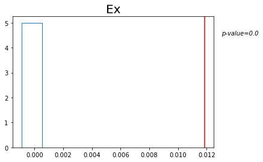

```python
import multiprocessing
import pandas as pd
import numpy as np
import matplotlib.pyplot as plt

from geneclusters.cluster_genes import score_for_thres, get_kernighan_lin_clusters
from geneclusters.prepare_inputs import get_gene_pathway_matrix
from geneclusters.compute_stats import compute_t, compute_permuted_t, return_correlation_matrix, return_permutation_inputs, run_permutations, compute_permutation_p
from geneclusters.plotting import plot_permutations

cpu = multiprocessing.cpu_count()
pool = multiprocessing.Pool(cpu-1)
```

    Process ForkPoolWorker-80:
    Process ForkPoolWorker-73:
    Process ForkPoolWorker-78:
    Process ForkPoolWorker-64:
    Process ForkPoolWorker-82:
    Process ForkPoolWorker-57:
    Process ForkPoolWorker-67:
    Process ForkPoolWorker-87:
    Process ForkPoolWorker-65:
    Process ForkPoolWorker-72:
    Process ForkPoolWorker-49:
    Process ForkPoolWorker-85:
    Process ForkPoolWorker-70:
    Process ForkPoolWorker-68:
    Process ForkPoolWorker-52:
    Process ForkPoolWorker-60:
    Process ForkPoolWorker-54:
    Process ForkPoolWorker-56:
    Process ForkPoolWorker-88:
    Process ForkPoolWorker-93:
    Process ForkPoolWorker-84:
    Process ForkPoolWorker-90:
    Process ForkPoolWorker-75:
    Process ForkPoolWorker-50:
    Process ForkPoolWorker-91:
    Process ForkPoolWorker-66:
    Process ForkPoolWorker-81:
    Process ForkPoolWorker-35:
    Process ForkPoolWorker-76:
    Process ForkPoolWorker-45:
    Process ForkPoolWorker-46:
    Process ForkPoolWorker-44:
    Process ForkPoolWorker-28:
    Process ForkPoolWorker-94:
    Process ForkPoolWorker-42:
    Process ForkPoolWorker-39:
    Process ForkPoolWorker-61:
    Process ForkPoolWorker-92:
    Process ForkPoolWorker-59:
    Process ForkPoolWorker-30:
    Process ForkPoolWorker-40:
    Process ForkPoolWorker-37:
    Process ForkPoolWorker-12:
    Process ForkPoolWorker-55:
    Process ForkPoolWorker-26:
    Process ForkPoolWorker-38:
    Process ForkPoolWorker-10:
    Process ForkPoolWorker-3:
    Process ForkPoolWorker-27:
    Process ForkPoolWorker-4:
    Process ForkPoolWorker-9:
    Process ForkPoolWorker-86:
    Process ForkPoolWorker-21:
    Process ForkPoolWorker-23:
    Process ForkPoolWorker-15:
    Process ForkPoolWorker-20:
    Process ForkPoolWorker-25:
    Process ForkPoolWorker-63:
    Process ForkPoolWorker-19:
    Process ForkPoolWorker-43:
    Process ForkPoolWorker-24:
    Process ForkPoolWorker-53:
    Process ForkPoolWorker-51:
    Process ForkPoolWorker-47:
    Process ForkPoolWorker-69:
    Process ForkPoolWorker-62:
    Process ForkPoolWorker-71:
    Process ForkPoolWorker-5:
    Process ForkPoolWorker-1:
    Process ForkPoolWorker-8:
    Process ForkPoolWorker-74:
    Process ForkPoolWorker-2:
    Process ForkPoolWorker-7:
    Process ForkPoolWorker-77:
    Process ForkPoolWorker-6:
    Process ForkPoolWorker-22:
    Process ForkPoolWorker-14:
    Process ForkPoolWorker-17:
    Process ForkPoolWorker-48:
    Process ForkPoolWorker-41:
    Process ForkPoolWorker-18:
    Process ForkPoolWorker-79:
    Process ForkPoolWorker-58:
    Process ForkPoolWorker-34:
    Process ForkPoolWorker-33:
    Process ForkPoolWorker-36:
    Process ForkPoolWorker-11:
    Process ForkPoolWorker-16:
    Process ForkPoolWorker-13:
    Process ForkPoolWorker-29:
    Process ForkPoolWorker-89:
    Process ForkPoolWorker-83:
    Process ForkPoolWorker-31:
    Process ForkPoolWorker-95:
    Process ForkPoolWorker-32:
    Traceback (most recent call last):
    Traceback (most recent call last):
    Traceback (most recent call last):
    Traceback (most recent call last):
    Traceback (most recent call last):
    Traceback (most recent call last):
    Traceback (most recent call last):
    Traceback (most recent call last):
    Traceback (most recent call last):
    Traceback (most recent call last):
    Traceback (most recent call last):
    Traceback (most recent call last):
    Traceback (most recent call last):
    Traceback (most recent call last):
    Traceback (most recent call last):
    Traceback (most recent call last):
    Traceback (most recent call last):
    Traceback (most recent call last):
    Traceback (most recent call last):
    Traceback (most recent call last):
    Traceback (most recent call last):
    Traceback (most recent call last):
    Traceback (most recent call last):
    Traceback (most recent call last):
    Traceback (most recent call last):
    Traceback (most recent call last):
    Traceback (most recent call last):
    Traceback (most recent call last):
    Traceback (most recent call last):
    Traceback (most recent call last):
    Traceback (most recent call last):
    Traceback (most recent call last):
    Traceback (most recent call last):
    Traceback (most recent call last):
    Traceback (most recent call last):
    Traceback (most recent call last):
    Traceback (most recent call last):
    Traceback (most recent call last):
    Traceback (most recent call last):
    Traceback (most recent call last):
    Traceback (most recent call last):
    Traceback (most recent call last):
    Traceback (most recent call last):
    Traceback (most recent call last):
    Traceback (most recent call last):
    Traceback (most recent call last):
    Traceback (most recent call last):
    Traceback (most recent call last):
    Traceback (most recent call last):
    Traceback (most recent call last):
    Traceback (most recent call last):
    Traceback (most recent call last):
    Traceback (most recent call last):
    Traceback (most recent call last):
    Traceback (most recent call last):
    Traceback (most recent call last):
    Traceback (most recent call last):
    Traceback (most recent call last):
    Traceback (most recent call last):
    Traceback (most recent call last):
    Traceback (most recent call last):
    Traceback (most recent call last):
    Traceback (most recent call last):
    Traceback (most recent call last):
    Traceback (most recent call last):
    Traceback (most recent call last):
    Traceback (most recent call last):
    Traceback (most recent call last):
      File "/state/partition1/llgrid/pkg/anaconda/anaconda3-2022a/lib/python3.8/multiprocessing/process.py", line 315, in _bootstrap
        self.run()
    Traceback (most recent call last):
    Traceback (most recent call last):
      File "/state/partition1/llgrid/pkg/anaconda/anaconda3-2022a/lib/python3.8/multiprocessing/process.py", line 315, in _bootstrap
        self.run()
      File "/state/partition1/llgrid/pkg/anaconda/anaconda3-2022a/lib/python3.8/multiprocessing/process.py", line 315, in _bootstrap
        self.run()
      File "/state/partition1/llgrid/pkg/anaconda/anaconda3-2022a/lib/python3.8/multiprocessing/process.py", line 315, in _bootstrap
        self.run()
      File "/state/partition1/llgrid/pkg/anaconda/anaconda3-2022a/lib/python3.8/multiprocessing/process.py", line 315, in _bootstrap
        self.run()
      File "/state/partition1/llgrid/pkg/anaconda/anaconda3-2022a/lib/python3.8/multiprocessing/process.py", line 315, in _bootstrap
        self.run()
      File "/state/partition1/llgrid/pkg/anaconda/anaconda3-2022a/lib/python3.8/multiprocessing/process.py", line 315, in _bootstrap
        self.run()
    Traceback (most recent call last):
      File "/state/partition1/llgrid/pkg/anaconda/anaconda3-2022a/lib/python3.8/multiprocessing/process.py", line 315, in _bootstrap
        self.run()
      File "/state/partition1/llgrid/pkg/anaconda/anaconda3-2022a/lib/python3.8/multiprocessing/process.py", line 315, in _bootstrap
        self.run()
    Traceback (most recent call last):
      File "/state/partition1/llgrid/pkg/anaconda/anaconda3-2022a/lib/python3.8/multiprocessing/process.py", line 315, in _bootstrap
        self.run()
      File "/state/partition1/llgrid/pkg/anaconda/anaconda3-2022a/lib/python3.8/multiprocessing/process.py", line 315, in _bootstrap
        self.run()
    Traceback (most recent call last):
      File "/state/partition1/llgrid/pkg/anaconda/anaconda3-2022a/lib/python3.8/multiprocessing/process.py", line 315, in _bootstrap
        self.run()
    Traceback (most recent call last):
    Traceback (most recent call last):
    Traceback (most recent call last):
      File "/state/partition1/llgrid/pkg/anaconda/anaconda3-2022a/lib/python3.8/multiprocessing/process.py", line 315, in _bootstrap
        self.run()
      File "/state/partition1/llgrid/pkg/anaconda/anaconda3-2022a/lib/python3.8/multiprocessing/process.py", line 315, in _bootstrap
        self.run()
      File "/state/partition1/llgrid/pkg/anaconda/anaconda3-2022a/lib/python3.8/multiprocessing/process.py", line 315, in _bootstrap
        self.run()
      File "/state/partition1/llgrid/pkg/anaconda/anaconda3-2022a/lib/python3.8/multiprocessing/process.py", line 315, in _bootstrap
        self.run()
      File "/state/partition1/llgrid/pkg/anaconda/anaconda3-2022a/lib/python3.8/multiprocessing/process.py", line 315, in _bootstrap
        self.run()
      File "/state/partition1/llgrid/pkg/anaconda/anaconda3-2022a/lib/python3.8/multiprocessing/process.py", line 315, in _bootstrap
        self.run()
    Traceback (most recent call last):
      File "/state/partition1/llgrid/pkg/anaconda/anaconda3-2022a/lib/python3.8/multiprocessing/process.py", line 315, in _bootstrap
        self.run()
      File "/state/partition1/llgrid/pkg/anaconda/anaconda3-2022a/lib/python3.8/multiprocessing/process.py", line 315, in _bootstrap
        self.run()
      File "/state/partition1/llgrid/pkg/anaconda/anaconda3-2022a/lib/python3.8/multiprocessing/process.py", line 315, in _bootstrap
        self.run()
    Traceback (most recent call last):
    Traceback (most recent call last):
    Traceback (most recent call last):
    Traceback (most recent call last):
    Traceback (most recent call last):
      File "/state/partition1/llgrid/pkg/anaconda/anaconda3-2022a/lib/python3.8/multiprocessing/process.py", line 315, in _bootstrap
        self.run()
    Traceback (most recent call last):
    Traceback (most recent call last):
    Traceback (most recent call last):
    Traceback (most recent call last):
    Traceback (most recent call last):
      File "/state/partition1/llgrid/pkg/anaconda/anaconda3-2022a/lib/python3.8/multiprocessing/process.py", line 315, in _bootstrap
        self.run()
      File "/state/partition1/llgrid/pkg/anaconda/anaconda3-2022a/lib/python3.8/multiprocessing/process.py", line 315, in _bootstrap
        self.run()
      File "/state/partition1/llgrid/pkg/anaconda/anaconda3-2022a/lib/python3.8/multiprocessing/process.py", line 315, in _bootstrap
        self.run()
      File "/state/partition1/llgrid/pkg/anaconda/anaconda3-2022a/lib/python3.8/multiprocessing/process.py", line 315, in _bootstrap
        self.run()
    Traceback (most recent call last):
      File "/state/partition1/llgrid/pkg/anaconda/anaconda3-2022a/lib/python3.8/multiprocessing/process.py", line 315, in _bootstrap
        self.run()
      File "/state/partition1/llgrid/pkg/anaconda/anaconda3-2022a/lib/python3.8/multiprocessing/process.py", line 315, in _bootstrap
        self.run()
      File "/state/partition1/llgrid/pkg/anaconda/anaconda3-2022a/lib/python3.8/multiprocessing/process.py", line 315, in _bootstrap
        self.run()
      File "/state/partition1/llgrid/pkg/anaconda/anaconda3-2022a/lib/python3.8/multiprocessing/process.py", line 315, in _bootstrap
        self.run()
      File "/state/partition1/llgrid/pkg/anaconda/anaconda3-2022a/lib/python3.8/multiprocessing/process.py", line 315, in _bootstrap
        self.run()
      File "/state/partition1/llgrid/pkg/anaconda/anaconda3-2022a/lib/python3.8/multiprocessing/process.py", line 315, in _bootstrap
        self.run()
      File "/state/partition1/llgrid/pkg/anaconda/anaconda3-2022a/lib/python3.8/multiprocessing/process.py", line 315, in _bootstrap
        self.run()
    Traceback (most recent call last):
      File "/state/partition1/llgrid/pkg/anaconda/anaconda3-2022a/lib/python3.8/multiprocessing/process.py", line 315, in _bootstrap
        self.run()
      File "/state/partition1/llgrid/pkg/anaconda/anaconda3-2022a/lib/python3.8/multiprocessing/process.py", line 315, in _bootstrap
        self.run()
    Traceback (most recent call last):
    Traceback (most recent call last):
      File "/state/partition1/llgrid/pkg/anaconda/anaconda3-2022a/lib/python3.8/multiprocessing/process.py", line 315, in _bootstrap
        self.run()
      File "/state/partition1/llgrid/pkg/anaconda/anaconda3-2022a/lib/python3.8/multiprocessing/process.py", line 315, in _bootstrap
        self.run()
      File "/state/partition1/llgrid/pkg/anaconda/anaconda3-2022a/lib/python3.8/multiprocessing/process.py", line 315, in _bootstrap
        self.run()
      File "/state/partition1/llgrid/pkg/anaconda/anaconda3-2022a/lib/python3.8/multiprocessing/process.py", line 315, in _bootstrap
        self.run()
      File "/state/partition1/llgrid/pkg/anaconda/anaconda3-2022a/lib/python3.8/multiprocessing/process.py", line 315, in _bootstrap
        self.run()
      File "/state/partition1/llgrid/pkg/anaconda/anaconda3-2022a/lib/python3.8/multiprocessing/process.py", line 315, in _bootstrap
        self.run()
    Traceback (most recent call last):
      File "/state/partition1/llgrid/pkg/anaconda/anaconda3-2022a/lib/python3.8/multiprocessing/process.py", line 315, in _bootstrap
        self.run()
      File "/state/partition1/llgrid/pkg/anaconda/anaconda3-2022a/lib/python3.8/multiprocessing/process.py", line 315, in _bootstrap
        self.run()
    Traceback (most recent call last):
    Traceback (most recent call last):
      File "/state/partition1/llgrid/pkg/anaconda/anaconda3-2022a/lib/python3.8/multiprocessing/process.py", line 315, in _bootstrap
        self.run()
      File "/state/partition1/llgrid/pkg/anaconda/anaconda3-2022a/lib/python3.8/multiprocessing/process.py", line 315, in _bootstrap
        self.run()
    Traceback (most recent call last):
      File "/state/partition1/llgrid/pkg/anaconda/anaconda3-2022a/lib/python3.8/multiprocessing/process.py", line 315, in _bootstrap
        self.run()
      File "/state/partition1/llgrid/pkg/anaconda/anaconda3-2022a/lib/python3.8/multiprocessing/process.py", line 315, in _bootstrap
        self.run()
      File "/state/partition1/llgrid/pkg/anaconda/anaconda3-2022a/lib/python3.8/multiprocessing/process.py", line 315, in _bootstrap
        self.run()
      File "/state/partition1/llgrid/pkg/anaconda/anaconda3-2022a/lib/python3.8/multiprocessing/process.py", line 315, in _bootstrap
        self.run()
      File "/state/partition1/llgrid/pkg/anaconda/anaconda3-2022a/lib/python3.8/multiprocessing/process.py", line 315, in _bootstrap
        self.run()
      File "/state/partition1/llgrid/pkg/anaconda/anaconda3-2022a/lib/python3.8/multiprocessing/process.py", line 315, in _bootstrap
        self.run()
      File "/state/partition1/llgrid/pkg/anaconda/anaconda3-2022a/lib/python3.8/multiprocessing/process.py", line 315, in _bootstrap
        self.run()
      File "/state/partition1/llgrid/pkg/anaconda/anaconda3-2022a/lib/python3.8/multiprocessing/process.py", line 315, in _bootstrap
        self.run()
      File "/state/partition1/llgrid/pkg/anaconda/anaconda3-2022a/lib/python3.8/multiprocessing/process.py", line 315, in _bootstrap
        self.run()
      File "/state/partition1/llgrid/pkg/anaconda/anaconda3-2022a/lib/python3.8/multiprocessing/process.py", line 315, in _bootstrap
        self.run()
      File "/state/partition1/llgrid/pkg/anaconda/anaconda3-2022a/lib/python3.8/multiprocessing/process.py", line 315, in _bootstrap
        self.run()
      File "/state/partition1/llgrid/pkg/anaconda/anaconda3-2022a/lib/python3.8/multiprocessing/process.py", line 315, in _bootstrap
        self.run()
      File "/state/partition1/llgrid/pkg/anaconda/anaconda3-2022a/lib/python3.8/multiprocessing/process.py", line 315, in _bootstrap
        self.run()
      File "/state/partition1/llgrid/pkg/anaconda/anaconda3-2022a/lib/python3.8/multiprocessing/process.py", line 315, in _bootstrap
        self.run()
      File "/state/partition1/llgrid/pkg/anaconda/anaconda3-2022a/lib/python3.8/multiprocessing/process.py", line 315, in _bootstrap
        self.run()
      File "/state/partition1/llgrid/pkg/anaconda/anaconda3-2022a/lib/python3.8/multiprocessing/process.py", line 315, in _bootstrap
        self.run()
      File "/state/partition1/llgrid/pkg/anaconda/anaconda3-2022a/lib/python3.8/multiprocessing/process.py", line 315, in _bootstrap
        self.run()
      File "/state/partition1/llgrid/pkg/anaconda/anaconda3-2022a/lib/python3.8/multiprocessing/process.py", line 315, in _bootstrap
        self.run()
      File "/state/partition1/llgrid/pkg/anaconda/anaconda3-2022a/lib/python3.8/multiprocessing/process.py", line 315, in _bootstrap
        self.run()
      File "/state/partition1/llgrid/pkg/anaconda/anaconda3-2022a/lib/python3.8/multiprocessing/process.py", line 315, in _bootstrap
        self.run()
      File "/state/partition1/llgrid/pkg/anaconda/anaconda3-2022a/lib/python3.8/multiprocessing/process.py", line 108, in run
        self._target(*self._args, **self._kwargs)
      File "/state/partition1/llgrid/pkg/anaconda/anaconda3-2022a/lib/python3.8/multiprocessing/process.py", line 108, in run
        self._target(*self._args, **self._kwargs)
      File "/state/partition1/llgrid/pkg/anaconda/anaconda3-2022a/lib/python3.8/multiprocessing/process.py", line 108, in run
        self._target(*self._args, **self._kwargs)
      File "/state/partition1/llgrid/pkg/anaconda/anaconda3-2022a/lib/python3.8/multiprocessing/process.py", line 315, in _bootstrap
        self.run()
      File "/state/partition1/llgrid/pkg/anaconda/anaconda3-2022a/lib/python3.8/multiprocessing/process.py", line 315, in _bootstrap
        self.run()
      File "/state/partition1/llgrid/pkg/anaconda/anaconda3-2022a/lib/python3.8/multiprocessing/process.py", line 108, in run
        self._target(*self._args, **self._kwargs)
      File "/state/partition1/llgrid/pkg/anaconda/anaconda3-2022a/lib/python3.8/multiprocessing/process.py", line 108, in run
        self._target(*self._args, **self._kwargs)
      File "/state/partition1/llgrid/pkg/anaconda/anaconda3-2022a/lib/python3.8/multiprocessing/process.py", line 315, in _bootstrap
        self.run()
      File "/state/partition1/llgrid/pkg/anaconda/anaconda3-2022a/lib/python3.8/multiprocessing/process.py", line 315, in _bootstrap
        self.run()
      File "/state/partition1/llgrid/pkg/anaconda/anaconda3-2022a/lib/python3.8/multiprocessing/process.py", line 108, in run
        self._target(*self._args, **self._kwargs)
      File "/state/partition1/llgrid/pkg/anaconda/anaconda3-2022a/lib/python3.8/multiprocessing/process.py", line 108, in run
        self._target(*self._args, **self._kwargs)
      File "/state/partition1/llgrid/pkg/anaconda/anaconda3-2022a/lib/python3.8/multiprocessing/process.py", line 108, in run
        self._target(*self._args, **self._kwargs)
      File "/state/partition1/llgrid/pkg/anaconda/anaconda3-2022a/lib/python3.8/multiprocessing/process.py", line 315, in _bootstrap
        self.run()
      File "/state/partition1/llgrid/pkg/anaconda/anaconda3-2022a/lib/python3.8/multiprocessing/process.py", line 108, in run
        self._target(*self._args, **self._kwargs)
      File "/state/partition1/llgrid/pkg/anaconda/anaconda3-2022a/lib/python3.8/multiprocessing/process.py", line 108, in run
        self._target(*self._args, **self._kwargs)
      File "/state/partition1/llgrid/pkg/anaconda/anaconda3-2022a/lib/python3.8/multiprocessing/process.py", line 315, in _bootstrap
        self.run()
      File "/state/partition1/llgrid/pkg/anaconda/anaconda3-2022a/lib/python3.8/multiprocessing/process.py", line 108, in run
        self._target(*self._args, **self._kwargs)
      File "/state/partition1/llgrid/pkg/anaconda/anaconda3-2022a/lib/python3.8/multiprocessing/process.py", line 108, in run
        self._target(*self._args, **self._kwargs)
      File "/state/partition1/llgrid/pkg/anaconda/anaconda3-2022a/lib/python3.8/multiprocessing/process.py", line 315, in _bootstrap
        self.run()
      File "/state/partition1/llgrid/pkg/anaconda/anaconda3-2022a/lib/python3.8/multiprocessing/process.py", line 315, in _bootstrap
        self.run()
      File "/state/partition1/llgrid/pkg/anaconda/anaconda3-2022a/lib/python3.8/multiprocessing/process.py", line 108, in run
        self._target(*self._args, **self._kwargs)
      File "/state/partition1/llgrid/pkg/anaconda/anaconda3-2022a/lib/python3.8/multiprocessing/process.py", line 108, in run
        self._target(*self._args, **self._kwargs)
      File "/state/partition1/llgrid/pkg/anaconda/anaconda3-2022a/lib/python3.8/multiprocessing/process.py", line 315, in _bootstrap
        self.run()
      File "/state/partition1/llgrid/pkg/anaconda/anaconda3-2022a/lib/python3.8/multiprocessing/process.py", line 315, in _bootstrap
        self.run()
      File "/state/partition1/llgrid/pkg/anaconda/anaconda3-2022a/lib/python3.8/multiprocessing/process.py", line 108, in run
        self._target(*self._args, **self._kwargs)
      File "/state/partition1/llgrid/pkg/anaconda/anaconda3-2022a/lib/python3.8/multiprocessing/process.py", line 315, in _bootstrap
        self.run()
      File "/state/partition1/llgrid/pkg/anaconda/anaconda3-2022a/lib/python3.8/multiprocessing/process.py", line 108, in run
        self._target(*self._args, **self._kwargs)
      File "/state/partition1/llgrid/pkg/anaconda/anaconda3-2022a/lib/python3.8/multiprocessing/process.py", line 108, in run
        self._target(*self._args, **self._kwargs)
      File "/state/partition1/llgrid/pkg/anaconda/anaconda3-2022a/lib/python3.8/multiprocessing/process.py", line 108, in run
        self._target(*self._args, **self._kwargs)
      File "/state/partition1/llgrid/pkg/anaconda/anaconda3-2022a/lib/python3.8/multiprocessing/process.py", line 108, in run
        self._target(*self._args, **self._kwargs)
      File "/state/partition1/llgrid/pkg/anaconda/anaconda3-2022a/lib/python3.8/multiprocessing/process.py", line 315, in _bootstrap
        self.run()
      File "/state/partition1/llgrid/pkg/anaconda/anaconda3-2022a/lib/python3.8/multiprocessing/process.py", line 108, in run
        self._target(*self._args, **self._kwargs)
      File "/state/partition1/llgrid/pkg/anaconda/anaconda3-2022a/lib/python3.8/multiprocessing/process.py", line 315, in _bootstrap
        self.run()
      File "/state/partition1/llgrid/pkg/anaconda/anaconda3-2022a/lib/python3.8/multiprocessing/process.py", line 315, in _bootstrap
        self.run()
      File "/state/partition1/llgrid/pkg/anaconda/anaconda3-2022a/lib/python3.8/multiprocessing/process.py", line 108, in run
        self._target(*self._args, **self._kwargs)
      File "/state/partition1/llgrid/pkg/anaconda/anaconda3-2022a/lib/python3.8/multiprocessing/process.py", line 315, in _bootstrap
        self.run()
      File "/state/partition1/llgrid/pkg/anaconda/anaconda3-2022a/lib/python3.8/multiprocessing/process.py", line 315, in _bootstrap
        self.run()
      File "/state/partition1/llgrid/pkg/anaconda/anaconda3-2022a/lib/python3.8/multiprocessing/process.py", line 315, in _bootstrap
        self.run()
      File "/state/partition1/llgrid/pkg/anaconda/anaconda3-2022a/lib/python3.8/multiprocessing/process.py", line 108, in run
        self._target(*self._args, **self._kwargs)
      File "/state/partition1/llgrid/pkg/anaconda/anaconda3-2022a/lib/python3.8/multiprocessing/process.py", line 315, in _bootstrap
        self.run()
      File "/state/partition1/llgrid/pkg/anaconda/anaconda3-2022a/lib/python3.8/multiprocessing/process.py", line 315, in _bootstrap
        self.run()
      File "/state/partition1/llgrid/pkg/anaconda/anaconda3-2022a/lib/python3.8/multiprocessing/process.py", line 315, in _bootstrap
        self.run()
      File "/state/partition1/llgrid/pkg/anaconda/anaconda3-2022a/lib/python3.8/multiprocessing/process.py", line 108, in run
        self._target(*self._args, **self._kwargs)
      File "/state/partition1/llgrid/pkg/anaconda/anaconda3-2022a/lib/python3.8/multiprocessing/process.py", line 315, in _bootstrap
        self.run()
      File "/state/partition1/llgrid/pkg/anaconda/anaconda3-2022a/lib/python3.8/multiprocessing/process.py", line 108, in run
        self._target(*self._args, **self._kwargs)
      File "/state/partition1/llgrid/pkg/anaconda/anaconda3-2022a/lib/python3.8/multiprocessing/process.py", line 108, in run
        self._target(*self._args, **self._kwargs)
      File "/state/partition1/llgrid/pkg/anaconda/anaconda3-2022a/lib/python3.8/multiprocessing/process.py", line 315, in _bootstrap
        self.run()
      File "/state/partition1/llgrid/pkg/anaconda/anaconda3-2022a/lib/python3.8/multiprocessing/process.py", line 108, in run
        self._target(*self._args, **self._kwargs)
      File "/state/partition1/llgrid/pkg/anaconda/anaconda3-2022a/lib/python3.8/multiprocessing/process.py", line 108, in run
        self._target(*self._args, **self._kwargs)
      File "/state/partition1/llgrid/pkg/anaconda/anaconda3-2022a/lib/python3.8/multiprocessing/process.py", line 108, in run
        self._target(*self._args, **self._kwargs)
      File "/state/partition1/llgrid/pkg/anaconda/anaconda3-2022a/lib/python3.8/multiprocessing/process.py", line 108, in run
        self._target(*self._args, **self._kwargs)
      File "/state/partition1/llgrid/pkg/anaconda/anaconda3-2022a/lib/python3.8/multiprocessing/process.py", line 108, in run
        self._target(*self._args, **self._kwargs)
      File "/state/partition1/llgrid/pkg/anaconda/anaconda3-2022a/lib/python3.8/multiprocessing/process.py", line 315, in _bootstrap
        self.run()
      File "/state/partition1/llgrid/pkg/anaconda/anaconda3-2022a/lib/python3.8/multiprocessing/process.py", line 108, in run
        self._target(*self._args, **self._kwargs)
      File "/state/partition1/llgrid/pkg/anaconda/anaconda3-2022a/lib/python3.8/multiprocessing/process.py", line 108, in run
        self._target(*self._args, **self._kwargs)
      File "/state/partition1/llgrid/pkg/anaconda/anaconda3-2022a/lib/python3.8/multiprocessing/process.py", line 108, in run
        self._target(*self._args, **self._kwargs)
      File "/state/partition1/llgrid/pkg/anaconda/anaconda3-2022a/lib/python3.8/multiprocessing/process.py", line 315, in _bootstrap
        self.run()
      File "/state/partition1/llgrid/pkg/anaconda/anaconda3-2022a/lib/python3.8/multiprocessing/process.py", line 108, in run
        self._target(*self._args, **self._kwargs)
      File "/state/partition1/llgrid/pkg/anaconda/anaconda3-2022a/lib/python3.8/multiprocessing/process.py", line 108, in run
        self._target(*self._args, **self._kwargs)
      File "/state/partition1/llgrid/pkg/anaconda/anaconda3-2022a/lib/python3.8/multiprocessing/process.py", line 108, in run
        self._target(*self._args, **self._kwargs)
      File "/state/partition1/llgrid/pkg/anaconda/anaconda3-2022a/lib/python3.8/multiprocessing/process.py", line 108, in run
        self._target(*self._args, **self._kwargs)
      File "/state/partition1/llgrid/pkg/anaconda/anaconda3-2022a/lib/python3.8/multiprocessing/process.py", line 108, in run
        self._target(*self._args, **self._kwargs)
      File "/state/partition1/llgrid/pkg/anaconda/anaconda3-2022a/lib/python3.8/multiprocessing/process.py", line 108, in run
        self._target(*self._args, **self._kwargs)
      File "/state/partition1/llgrid/pkg/anaconda/anaconda3-2022a/lib/python3.8/multiprocessing/process.py", line 315, in _bootstrap
        self.run()
      File "/state/partition1/llgrid/pkg/anaconda/anaconda3-2022a/lib/python3.8/multiprocessing/process.py", line 108, in run
        self._target(*self._args, **self._kwargs)
      File "/state/partition1/llgrid/pkg/anaconda/anaconda3-2022a/lib/python3.8/multiprocessing/process.py", line 108, in run
        self._target(*self._args, **self._kwargs)
      File "/state/partition1/llgrid/pkg/anaconda/anaconda3-2022a/lib/python3.8/multiprocessing/process.py", line 315, in _bootstrap
        self.run()
      File "/state/partition1/llgrid/pkg/anaconda/anaconda3-2022a/lib/python3.8/multiprocessing/process.py", line 315, in _bootstrap
        self.run()
      File "/state/partition1/llgrid/pkg/anaconda/anaconda3-2022a/lib/python3.8/multiprocessing/process.py", line 108, in run
        self._target(*self._args, **self._kwargs)
      File "/state/partition1/llgrid/pkg/anaconda/anaconda3-2022a/lib/python3.8/multiprocessing/process.py", line 108, in run
        self._target(*self._args, **self._kwargs)
      File "/state/partition1/llgrid/pkg/anaconda/anaconda3-2022a/lib/python3.8/multiprocessing/process.py", line 108, in run
        self._target(*self._args, **self._kwargs)
      File "/state/partition1/llgrid/pkg/anaconda/anaconda3-2022a/lib/python3.8/multiprocessing/process.py", line 108, in run
        self._target(*self._args, **self._kwargs)
      File "/state/partition1/llgrid/pkg/anaconda/anaconda3-2022a/lib/python3.8/multiprocessing/process.py", line 108, in run
        self._target(*self._args, **self._kwargs)
      File "/state/partition1/llgrid/pkg/anaconda/anaconda3-2022a/lib/python3.8/multiprocessing/process.py", line 108, in run
        self._target(*self._args, **self._kwargs)
      File "/state/partition1/llgrid/pkg/anaconda/anaconda3-2022a/lib/python3.8/multiprocessing/process.py", line 315, in _bootstrap
        self.run()
      File "/state/partition1/llgrid/pkg/anaconda/anaconda3-2022a/lib/python3.8/multiprocessing/process.py", line 108, in run
        self._target(*self._args, **self._kwargs)
      File "/state/partition1/llgrid/pkg/anaconda/anaconda3-2022a/lib/python3.8/multiprocessing/process.py", line 108, in run
        self._target(*self._args, **self._kwargs)
      File "/state/partition1/llgrid/pkg/anaconda/anaconda3-2022a/lib/python3.8/multiprocessing/process.py", line 108, in run
        self._target(*self._args, **self._kwargs)
      File "/state/partition1/llgrid/pkg/anaconda/anaconda3-2022a/lib/python3.8/multiprocessing/process.py", line 108, in run
        self._target(*self._args, **self._kwargs)
      File "/state/partition1/llgrid/pkg/anaconda/anaconda3-2022a/lib/python3.8/multiprocessing/process.py", line 315, in _bootstrap
        self.run()
      File "/state/partition1/llgrid/pkg/anaconda/anaconda3-2022a/lib/python3.8/multiprocessing/process.py", line 315, in _bootstrap
        self.run()
      File "/state/partition1/llgrid/pkg/anaconda/anaconda3-2022a/lib/python3.8/multiprocessing/process.py", line 108, in run
        self._target(*self._args, **self._kwargs)
      File "/state/partition1/llgrid/pkg/anaconda/anaconda3-2022a/lib/python3.8/multiprocessing/process.py", line 108, in run
        self._target(*self._args, **self._kwargs)
      File "/state/partition1/llgrid/pkg/anaconda/anaconda3-2022a/lib/python3.8/multiprocessing/process.py", line 108, in run
        self._target(*self._args, **self._kwargs)
      File "/state/partition1/llgrid/pkg/anaconda/anaconda3-2022a/lib/python3.8/multiprocessing/process.py", line 108, in run
        self._target(*self._args, **self._kwargs)
      File "/state/partition1/llgrid/pkg/anaconda/anaconda3-2022a/lib/python3.8/multiprocessing/process.py", line 108, in run
        self._target(*self._args, **self._kwargs)
      File "/state/partition1/llgrid/pkg/anaconda/anaconda3-2022a/lib/python3.8/multiprocessing/process.py", line 108, in run
        self._target(*self._args, **self._kwargs)
      File "/state/partition1/llgrid/pkg/anaconda/anaconda3-2022a/lib/python3.8/multiprocessing/process.py", line 108, in run
        self._target(*self._args, **self._kwargs)
      File "/state/partition1/llgrid/pkg/anaconda/anaconda3-2022a/lib/python3.8/multiprocessing/process.py", line 108, in run
        self._target(*self._args, **self._kwargs)
      File "/state/partition1/llgrid/pkg/anaconda/anaconda3-2022a/lib/python3.8/multiprocessing/process.py", line 108, in run
        self._target(*self._args, **self._kwargs)
      File "/state/partition1/llgrid/pkg/anaconda/anaconda3-2022a/lib/python3.8/multiprocessing/process.py", line 108, in run
        self._target(*self._args, **self._kwargs)
      File "/state/partition1/llgrid/pkg/anaconda/anaconda3-2022a/lib/python3.8/multiprocessing/process.py", line 108, in run
        self._target(*self._args, **self._kwargs)
      File "/state/partition1/llgrid/pkg/anaconda/anaconda3-2022a/lib/python3.8/multiprocessing/process.py", line 108, in run
        self._target(*self._args, **self._kwargs)
      File "/state/partition1/llgrid/pkg/anaconda/anaconda3-2022a/lib/python3.8/multiprocessing/pool.py", line 114, in worker
        task = get()
      File "/state/partition1/llgrid/pkg/anaconda/anaconda3-2022a/lib/python3.8/multiprocessing/process.py", line 108, in run
        self._target(*self._args, **self._kwargs)
      File "/state/partition1/llgrid/pkg/anaconda/anaconda3-2022a/lib/python3.8/multiprocessing/process.py", line 108, in run
        self._target(*self._args, **self._kwargs)
      File "/state/partition1/llgrid/pkg/anaconda/anaconda3-2022a/lib/python3.8/multiprocessing/pool.py", line 114, in worker
        task = get()
      File "/state/partition1/llgrid/pkg/anaconda/anaconda3-2022a/lib/python3.8/multiprocessing/pool.py", line 114, in worker
        task = get()
      File "/state/partition1/llgrid/pkg/anaconda/anaconda3-2022a/lib/python3.8/multiprocessing/pool.py", line 114, in worker
        task = get()
      File "/state/partition1/llgrid/pkg/anaconda/anaconda3-2022a/lib/python3.8/multiprocessing/process.py", line 108, in run
        self._target(*self._args, **self._kwargs)
      File "/state/partition1/llgrid/pkg/anaconda/anaconda3-2022a/lib/python3.8/multiprocessing/pool.py", line 114, in worker
        task = get()
      File "/state/partition1/llgrid/pkg/anaconda/anaconda3-2022a/lib/python3.8/multiprocessing/pool.py", line 114, in worker
        task = get()
      File "/state/partition1/llgrid/pkg/anaconda/anaconda3-2022a/lib/python3.8/multiprocessing/process.py", line 108, in run
        self._target(*self._args, **self._kwargs)
      File "/state/partition1/llgrid/pkg/anaconda/anaconda3-2022a/lib/python3.8/multiprocessing/pool.py", line 114, in worker
        task = get()
      File "/state/partition1/llgrid/pkg/anaconda/anaconda3-2022a/lib/python3.8/multiprocessing/process.py", line 108, in run
        self._target(*self._args, **self._kwargs)
      File "/state/partition1/llgrid/pkg/anaconda/anaconda3-2022a/lib/python3.8/multiprocessing/pool.py", line 114, in worker
        task = get()
      File "/state/partition1/llgrid/pkg/anaconda/anaconda3-2022a/lib/python3.8/multiprocessing/pool.py", line 114, in worker
        task = get()
      File "/state/partition1/llgrid/pkg/anaconda/anaconda3-2022a/lib/python3.8/multiprocessing/process.py", line 108, in run
        self._target(*self._args, **self._kwargs)
      File "/state/partition1/llgrid/pkg/anaconda/anaconda3-2022a/lib/python3.8/multiprocessing/process.py", line 108, in run
        self._target(*self._args, **self._kwargs)
      File "/state/partition1/llgrid/pkg/anaconda/anaconda3-2022a/lib/python3.8/multiprocessing/pool.py", line 114, in worker
        task = get()
      File "/state/partition1/llgrid/pkg/anaconda/anaconda3-2022a/lib/python3.8/multiprocessing/process.py", line 108, in run
        self._target(*self._args, **self._kwargs)
      File "/state/partition1/llgrid/pkg/anaconda/anaconda3-2022a/lib/python3.8/multiprocessing/pool.py", line 114, in worker
        task = get()
      File "/state/partition1/llgrid/pkg/anaconda/anaconda3-2022a/lib/python3.8/multiprocessing/pool.py", line 114, in worker
        task = get()
      File "/state/partition1/llgrid/pkg/anaconda/anaconda3-2022a/lib/python3.8/multiprocessing/pool.py", line 114, in worker
        task = get()
      File "/state/partition1/llgrid/pkg/anaconda/anaconda3-2022a/lib/python3.8/multiprocessing/pool.py", line 114, in worker
        task = get()
      File "/state/partition1/llgrid/pkg/anaconda/anaconda3-2022a/lib/python3.8/multiprocessing/process.py", line 108, in run
        self._target(*self._args, **self._kwargs)
      File "/state/partition1/llgrid/pkg/anaconda/anaconda3-2022a/lib/python3.8/multiprocessing/pool.py", line 114, in worker
        task = get()
      File "/state/partition1/llgrid/pkg/anaconda/anaconda3-2022a/lib/python3.8/multiprocessing/process.py", line 108, in run
        self._target(*self._args, **self._kwargs)
      File "/state/partition1/llgrid/pkg/anaconda/anaconda3-2022a/lib/python3.8/multiprocessing/pool.py", line 114, in worker
        task = get()
      File "/state/partition1/llgrid/pkg/anaconda/anaconda3-2022a/lib/python3.8/multiprocessing/process.py", line 108, in run
        self._target(*self._args, **self._kwargs)
      File "/state/partition1/llgrid/pkg/anaconda/anaconda3-2022a/lib/python3.8/multiprocessing/process.py", line 108, in run
        self._target(*self._args, **self._kwargs)
      File "/state/partition1/llgrid/pkg/anaconda/anaconda3-2022a/lib/python3.8/multiprocessing/process.py", line 108, in run
        self._target(*self._args, **self._kwargs)
      File "/state/partition1/llgrid/pkg/anaconda/anaconda3-2022a/lib/python3.8/multiprocessing/pool.py", line 114, in worker
        task = get()
      File "/state/partition1/llgrid/pkg/anaconda/anaconda3-2022a/lib/python3.8/multiprocessing/pool.py", line 114, in worker
        task = get()
      File "/state/partition1/llgrid/pkg/anaconda/anaconda3-2022a/lib/python3.8/multiprocessing/process.py", line 108, in run
        self._target(*self._args, **self._kwargs)
      File "/state/partition1/llgrid/pkg/anaconda/anaconda3-2022a/lib/python3.8/multiprocessing/pool.py", line 114, in worker
        task = get()
      File "/state/partition1/llgrid/pkg/anaconda/anaconda3-2022a/lib/python3.8/multiprocessing/pool.py", line 114, in worker
        task = get()
      File "/state/partition1/llgrid/pkg/anaconda/anaconda3-2022a/lib/python3.8/multiprocessing/pool.py", line 114, in worker
        task = get()
      File "/state/partition1/llgrid/pkg/anaconda/anaconda3-2022a/lib/python3.8/multiprocessing/process.py", line 108, in run
        self._target(*self._args, **self._kwargs)
      File "/state/partition1/llgrid/pkg/anaconda/anaconda3-2022a/lib/python3.8/multiprocessing/process.py", line 108, in run
        self._target(*self._args, **self._kwargs)
      File "/state/partition1/llgrid/pkg/anaconda/anaconda3-2022a/lib/python3.8/multiprocessing/pool.py", line 114, in worker
        task = get()
      File "/state/partition1/llgrid/pkg/anaconda/anaconda3-2022a/lib/python3.8/multiprocessing/process.py", line 108, in run
        self._target(*self._args, **self._kwargs)
      File "/state/partition1/llgrid/pkg/anaconda/anaconda3-2022a/lib/python3.8/multiprocessing/process.py", line 108, in run
        self._target(*self._args, **self._kwargs)
      File "/state/partition1/llgrid/pkg/anaconda/anaconda3-2022a/lib/python3.8/multiprocessing/process.py", line 108, in run
        self._target(*self._args, **self._kwargs)
      File "/state/partition1/llgrid/pkg/anaconda/anaconda3-2022a/lib/python3.8/multiprocessing/process.py", line 108, in run
        self._target(*self._args, **self._kwargs)
      File "/state/partition1/llgrid/pkg/anaconda/anaconda3-2022a/lib/python3.8/multiprocessing/process.py", line 108, in run
        self._target(*self._args, **self._kwargs)
      File "/state/partition1/llgrid/pkg/anaconda/anaconda3-2022a/lib/python3.8/multiprocessing/process.py", line 108, in run
        self._target(*self._args, **self._kwargs)
      File "/state/partition1/llgrid/pkg/anaconda/anaconda3-2022a/lib/python3.8/multiprocessing/process.py", line 108, in run
        self._target(*self._args, **self._kwargs)
      File "/state/partition1/llgrid/pkg/anaconda/anaconda3-2022a/lib/python3.8/multiprocessing/pool.py", line 114, in worker
        task = get()
      File "/state/partition1/llgrid/pkg/anaconda/anaconda3-2022a/lib/python3.8/multiprocessing/pool.py", line 114, in worker
        task = get()
      File "/state/partition1/llgrid/pkg/anaconda/anaconda3-2022a/lib/python3.8/multiprocessing/process.py", line 108, in run
        self._target(*self._args, **self._kwargs)
      File "/state/partition1/llgrid/pkg/anaconda/anaconda3-2022a/lib/python3.8/multiprocessing/pool.py", line 114, in worker
        task = get()
      File "/state/partition1/llgrid/pkg/anaconda/anaconda3-2022a/lib/python3.8/multiprocessing/pool.py", line 114, in worker
        task = get()
      File "/state/partition1/llgrid/pkg/anaconda/anaconda3-2022a/lib/python3.8/multiprocessing/pool.py", line 114, in worker
        task = get()
      File "/state/partition1/llgrid/pkg/anaconda/anaconda3-2022a/lib/python3.8/multiprocessing/pool.py", line 114, in worker
        task = get()
      File "/state/partition1/llgrid/pkg/anaconda/anaconda3-2022a/lib/python3.8/multiprocessing/pool.py", line 114, in worker
        task = get()
      File "/state/partition1/llgrid/pkg/anaconda/anaconda3-2022a/lib/python3.8/multiprocessing/pool.py", line 114, in worker
        task = get()
      File "/state/partition1/llgrid/pkg/anaconda/anaconda3-2022a/lib/python3.8/multiprocessing/process.py", line 108, in run
        self._target(*self._args, **self._kwargs)
      File "/state/partition1/llgrid/pkg/anaconda/anaconda3-2022a/lib/python3.8/multiprocessing/pool.py", line 114, in worker
        task = get()
      File "/state/partition1/llgrid/pkg/anaconda/anaconda3-2022a/lib/python3.8/multiprocessing/pool.py", line 114, in worker
        task = get()
      File "/state/partition1/llgrid/pkg/anaconda/anaconda3-2022a/lib/python3.8/multiprocessing/process.py", line 108, in run
        self._target(*self._args, **self._kwargs)
      File "/state/partition1/llgrid/pkg/anaconda/anaconda3-2022a/lib/python3.8/multiprocessing/pool.py", line 114, in worker
        task = get()
      File "/state/partition1/llgrid/pkg/anaconda/anaconda3-2022a/lib/python3.8/multiprocessing/pool.py", line 114, in worker
        task = get()
      File "/state/partition1/llgrid/pkg/anaconda/anaconda3-2022a/lib/python3.8/multiprocessing/pool.py", line 114, in worker
        task = get()
      File "/state/partition1/llgrid/pkg/anaconda/anaconda3-2022a/lib/python3.8/multiprocessing/pool.py", line 114, in worker
        task = get()
      File "/state/partition1/llgrid/pkg/anaconda/anaconda3-2022a/lib/python3.8/multiprocessing/pool.py", line 114, in worker
        task = get()
      File "/state/partition1/llgrid/pkg/anaconda/anaconda3-2022a/lib/python3.8/multiprocessing/pool.py", line 114, in worker
        task = get()
      File "/state/partition1/llgrid/pkg/anaconda/anaconda3-2022a/lib/python3.8/multiprocessing/process.py", line 108, in run
        self._target(*self._args, **self._kwargs)
      File "/state/partition1/llgrid/pkg/anaconda/anaconda3-2022a/lib/python3.8/multiprocessing/pool.py", line 114, in worker
        task = get()
      File "/state/partition1/llgrid/pkg/anaconda/anaconda3-2022a/lib/python3.8/multiprocessing/process.py", line 108, in run
        self._target(*self._args, **self._kwargs)
      File "/state/partition1/llgrid/pkg/anaconda/anaconda3-2022a/lib/python3.8/multiprocessing/pool.py", line 114, in worker
        task = get()
      File "/state/partition1/llgrid/pkg/anaconda/anaconda3-2022a/lib/python3.8/multiprocessing/process.py", line 108, in run
        self._target(*self._args, **self._kwargs)
      File "/state/partition1/llgrid/pkg/anaconda/anaconda3-2022a/lib/python3.8/multiprocessing/pool.py", line 114, in worker
        task = get()
      File "/state/partition1/llgrid/pkg/anaconda/anaconda3-2022a/lib/python3.8/multiprocessing/pool.py", line 114, in worker
        task = get()
      File "/state/partition1/llgrid/pkg/anaconda/anaconda3-2022a/lib/python3.8/multiprocessing/pool.py", line 114, in worker
        task = get()
      File "/state/partition1/llgrid/pkg/anaconda/anaconda3-2022a/lib/python3.8/multiprocessing/process.py", line 108, in run
        self._target(*self._args, **self._kwargs)
      File "/state/partition1/llgrid/pkg/anaconda/anaconda3-2022a/lib/python3.8/multiprocessing/pool.py", line 114, in worker
        task = get()
      File "/state/partition1/llgrid/pkg/anaconda/anaconda3-2022a/lib/python3.8/multiprocessing/pool.py", line 114, in worker
        task = get()
      File "/state/partition1/llgrid/pkg/anaconda/anaconda3-2022a/lib/python3.8/multiprocessing/pool.py", line 114, in worker
        task = get()
      File "/state/partition1/llgrid/pkg/anaconda/anaconda3-2022a/lib/python3.8/multiprocessing/pool.py", line 114, in worker
        task = get()
      File "/state/partition1/llgrid/pkg/anaconda/anaconda3-2022a/lib/python3.8/multiprocessing/pool.py", line 114, in worker
        task = get()
      File "/state/partition1/llgrid/pkg/anaconda/anaconda3-2022a/lib/python3.8/multiprocessing/pool.py", line 114, in worker
        task = get()
      File "/state/partition1/llgrid/pkg/anaconda/anaconda3-2022a/lib/python3.8/multiprocessing/pool.py", line 114, in worker
        task = get()
      File "/state/partition1/llgrid/pkg/anaconda/anaconda3-2022a/lib/python3.8/multiprocessing/process.py", line 108, in run
        self._target(*self._args, **self._kwargs)
      File "/state/partition1/llgrid/pkg/anaconda/anaconda3-2022a/lib/python3.8/multiprocessing/process.py", line 108, in run
        self._target(*self._args, **self._kwargs)
      File "/state/partition1/llgrid/pkg/anaconda/anaconda3-2022a/lib/python3.8/multiprocessing/pool.py", line 114, in worker
        task = get()
      File "/state/partition1/llgrid/pkg/anaconda/anaconda3-2022a/lib/python3.8/multiprocessing/pool.py", line 114, in worker
        task = get()
      File "/state/partition1/llgrid/pkg/anaconda/anaconda3-2022a/lib/python3.8/multiprocessing/pool.py", line 114, in worker
        task = get()
      File "/state/partition1/llgrid/pkg/anaconda/anaconda3-2022a/lib/python3.8/multiprocessing/pool.py", line 114, in worker
        task = get()
      File "/state/partition1/llgrid/pkg/anaconda/anaconda3-2022a/lib/python3.8/multiprocessing/pool.py", line 114, in worker
        task = get()
      File "/state/partition1/llgrid/pkg/anaconda/anaconda3-2022a/lib/python3.8/multiprocessing/pool.py", line 114, in worker
        task = get()
      File "/state/partition1/llgrid/pkg/anaconda/anaconda3-2022a/lib/python3.8/multiprocessing/pool.py", line 114, in worker
        task = get()
      File "/state/partition1/llgrid/pkg/anaconda/anaconda3-2022a/lib/python3.8/multiprocessing/pool.py", line 114, in worker
        task = get()
      File "/state/partition1/llgrid/pkg/anaconda/anaconda3-2022a/lib/python3.8/multiprocessing/pool.py", line 114, in worker
        task = get()
      File "/state/partition1/llgrid/pkg/anaconda/anaconda3-2022a/lib/python3.8/multiprocessing/queues.py", line 355, in get
        with self._rlock:
      File "/state/partition1/llgrid/pkg/anaconda/anaconda3-2022a/lib/python3.8/multiprocessing/pool.py", line 114, in worker
        task = get()
      File "/state/partition1/llgrid/pkg/anaconda/anaconda3-2022a/lib/python3.8/multiprocessing/pool.py", line 114, in worker
        task = get()
      File "/state/partition1/llgrid/pkg/anaconda/anaconda3-2022a/lib/python3.8/multiprocessing/pool.py", line 114, in worker
        task = get()
      File "/state/partition1/llgrid/pkg/anaconda/anaconda3-2022a/lib/python3.8/multiprocessing/queues.py", line 355, in get
        with self._rlock:
      File "/state/partition1/llgrid/pkg/anaconda/anaconda3-2022a/lib/python3.8/multiprocessing/pool.py", line 114, in worker
        task = get()
      File "/state/partition1/llgrid/pkg/anaconda/anaconda3-2022a/lib/python3.8/multiprocessing/pool.py", line 114, in worker
        task = get()
      File "/state/partition1/llgrid/pkg/anaconda/anaconda3-2022a/lib/python3.8/multiprocessing/queues.py", line 355, in get
        with self._rlock:
      File "/state/partition1/llgrid/pkg/anaconda/anaconda3-2022a/lib/python3.8/multiprocessing/pool.py", line 114, in worker
        task = get()
      File "/state/partition1/llgrid/pkg/anaconda/anaconda3-2022a/lib/python3.8/multiprocessing/queues.py", line 355, in get
        with self._rlock:
      File "/state/partition1/llgrid/pkg/anaconda/anaconda3-2022a/lib/python3.8/multiprocessing/queues.py", line 355, in get
        with self._rlock:
      File "/state/partition1/llgrid/pkg/anaconda/anaconda3-2022a/lib/python3.8/multiprocessing/pool.py", line 114, in worker
        task = get()
      File "/state/partition1/llgrid/pkg/anaconda/anaconda3-2022a/lib/python3.8/multiprocessing/queues.py", line 355, in get
        with self._rlock:
      File "/state/partition1/llgrid/pkg/anaconda/anaconda3-2022a/lib/python3.8/multiprocessing/queues.py", line 355, in get
        with self._rlock:
      File "/state/partition1/llgrid/pkg/anaconda/anaconda3-2022a/lib/python3.8/multiprocessing/pool.py", line 114, in worker
        task = get()
      File "/state/partition1/llgrid/pkg/anaconda/anaconda3-2022a/lib/python3.8/multiprocessing/queues.py", line 355, in get
        with self._rlock:
      File "/state/partition1/llgrid/pkg/anaconda/anaconda3-2022a/lib/python3.8/multiprocessing/pool.py", line 114, in worker
        task = get()
      File "/state/partition1/llgrid/pkg/anaconda/anaconda3-2022a/lib/python3.8/multiprocessing/queues.py", line 355, in get
        with self._rlock:
      File "/state/partition1/llgrid/pkg/anaconda/anaconda3-2022a/lib/python3.8/multiprocessing/queues.py", line 355, in get
        with self._rlock:
      File "/state/partition1/llgrid/pkg/anaconda/anaconda3-2022a/lib/python3.8/multiprocessing/pool.py", line 114, in worker
        task = get()
      File "/state/partition1/llgrid/pkg/anaconda/anaconda3-2022a/lib/python3.8/multiprocessing/queues.py", line 355, in get
        with self._rlock:
      File "/state/partition1/llgrid/pkg/anaconda/anaconda3-2022a/lib/python3.8/multiprocessing/queues.py", line 355, in get
        with self._rlock:
      File "/state/partition1/llgrid/pkg/anaconda/anaconda3-2022a/lib/python3.8/multiprocessing/queues.py", line 355, in get
        with self._rlock:
      File "/state/partition1/llgrid/pkg/anaconda/anaconda3-2022a/lib/python3.8/multiprocessing/pool.py", line 114, in worker
        task = get()
      File "/state/partition1/llgrid/pkg/anaconda/anaconda3-2022a/lib/python3.8/multiprocessing/pool.py", line 114, in worker
        task = get()
      File "/state/partition1/llgrid/pkg/anaconda/anaconda3-2022a/lib/python3.8/multiprocessing/queues.py", line 355, in get
        with self._rlock:
      File "/state/partition1/llgrid/pkg/anaconda/anaconda3-2022a/lib/python3.8/multiprocessing/queues.py", line 355, in get
        with self._rlock:
      File "/state/partition1/llgrid/pkg/anaconda/anaconda3-2022a/lib/python3.8/multiprocessing/queues.py", line 355, in get
        with self._rlock:
      File "/state/partition1/llgrid/pkg/anaconda/anaconda3-2022a/lib/python3.8/multiprocessing/pool.py", line 114, in worker
        task = get()
      File "/state/partition1/llgrid/pkg/anaconda/anaconda3-2022a/lib/python3.8/multiprocessing/pool.py", line 114, in worker
        task = get()
      File "/state/partition1/llgrid/pkg/anaconda/anaconda3-2022a/lib/python3.8/multiprocessing/pool.py", line 114, in worker
        task = get()
      File "/state/partition1/llgrid/pkg/anaconda/anaconda3-2022a/lib/python3.8/multiprocessing/queues.py", line 355, in get
        with self._rlock:
      File "/state/partition1/llgrid/pkg/anaconda/anaconda3-2022a/lib/python3.8/multiprocessing/queues.py", line 355, in get
        with self._rlock:
      File "/state/partition1/llgrid/pkg/anaconda/anaconda3-2022a/lib/python3.8/multiprocessing/queues.py", line 355, in get
        with self._rlock:
      File "/state/partition1/llgrid/pkg/anaconda/anaconda3-2022a/lib/python3.8/multiprocessing/pool.py", line 114, in worker
        task = get()
      File "/state/partition1/llgrid/pkg/anaconda/anaconda3-2022a/lib/python3.8/multiprocessing/pool.py", line 114, in worker
        task = get()
      File "/state/partition1/llgrid/pkg/anaconda/anaconda3-2022a/lib/python3.8/multiprocessing/queues.py", line 355, in get
        with self._rlock:
      File "/state/partition1/llgrid/pkg/anaconda/anaconda3-2022a/lib/python3.8/multiprocessing/queues.py", line 355, in get
        with self._rlock:
      File "/state/partition1/llgrid/pkg/anaconda/anaconda3-2022a/lib/python3.8/multiprocessing/pool.py", line 114, in worker
        task = get()
      File "/state/partition1/llgrid/pkg/anaconda/anaconda3-2022a/lib/python3.8/multiprocessing/queues.py", line 355, in get
        with self._rlock:
      File "/state/partition1/llgrid/pkg/anaconda/anaconda3-2022a/lib/python3.8/multiprocessing/pool.py", line 114, in worker
        task = get()
      File "/state/partition1/llgrid/pkg/anaconda/anaconda3-2022a/lib/python3.8/multiprocessing/pool.py", line 114, in worker
        task = get()
      File "/state/partition1/llgrid/pkg/anaconda/anaconda3-2022a/lib/python3.8/multiprocessing/pool.py", line 114, in worker
        task = get()
      File "/state/partition1/llgrid/pkg/anaconda/anaconda3-2022a/lib/python3.8/multiprocessing/pool.py", line 114, in worker
        task = get()
      File "/state/partition1/llgrid/pkg/anaconda/anaconda3-2022a/lib/python3.8/multiprocessing/pool.py", line 114, in worker
        task = get()
      File "/state/partition1/llgrid/pkg/anaconda/anaconda3-2022a/lib/python3.8/multiprocessing/pool.py", line 114, in worker
        task = get()
      File "/state/partition1/llgrid/pkg/anaconda/anaconda3-2022a/lib/python3.8/multiprocessing/queues.py", line 355, in get
        with self._rlock:
      File "/state/partition1/llgrid/pkg/anaconda/anaconda3-2022a/lib/python3.8/multiprocessing/pool.py", line 114, in worker
        task = get()
      File "/state/partition1/llgrid/pkg/anaconda/anaconda3-2022a/lib/python3.8/multiprocessing/pool.py", line 114, in worker
        task = get()
      File "/state/partition1/llgrid/pkg/anaconda/anaconda3-2022a/lib/python3.8/multiprocessing/queues.py", line 355, in get
        with self._rlock:
      File "/state/partition1/llgrid/pkg/anaconda/anaconda3-2022a/lib/python3.8/multiprocessing/queues.py", line 355, in get
        with self._rlock:
      File "/state/partition1/llgrid/pkg/anaconda/anaconda3-2022a/lib/python3.8/multiprocessing/pool.py", line 114, in worker
        task = get()
      File "/state/partition1/llgrid/pkg/anaconda/anaconda3-2022a/lib/python3.8/multiprocessing/pool.py", line 114, in worker
        task = get()
      File "/state/partition1/llgrid/pkg/anaconda/anaconda3-2022a/lib/python3.8/multiprocessing/queues.py", line 355, in get
        with self._rlock:
      File "/state/partition1/llgrid/pkg/anaconda/anaconda3-2022a/lib/python3.8/multiprocessing/queues.py", line 355, in get
        with self._rlock:
      File "/state/partition1/llgrid/pkg/anaconda/anaconda3-2022a/lib/python3.8/multiprocessing/pool.py", line 114, in worker
        task = get()
      File "/state/partition1/llgrid/pkg/anaconda/anaconda3-2022a/lib/python3.8/multiprocessing/queues.py", line 355, in get
        with self._rlock:
      File "/state/partition1/llgrid/pkg/anaconda/anaconda3-2022a/lib/python3.8/multiprocessing/queues.py", line 355, in get
        with self._rlock:
      File "/state/partition1/llgrid/pkg/anaconda/anaconda3-2022a/lib/python3.8/multiprocessing/queues.py", line 355, in get
        with self._rlock:
      File "/state/partition1/llgrid/pkg/anaconda/anaconda3-2022a/lib/python3.8/multiprocessing/queues.py", line 355, in get
        with self._rlock:
      File "/state/partition1/llgrid/pkg/anaconda/anaconda3-2022a/lib/python3.8/multiprocessing/queues.py", line 355, in get
        with self._rlock:
      File "/state/partition1/llgrid/pkg/anaconda/anaconda3-2022a/lib/python3.8/multiprocessing/queues.py", line 355, in get
        with self._rlock:
      File "/state/partition1/llgrid/pkg/anaconda/anaconda3-2022a/lib/python3.8/multiprocessing/queues.py", line 355, in get
        with self._rlock:
      File "/state/partition1/llgrid/pkg/anaconda/anaconda3-2022a/lib/python3.8/multiprocessing/queues.py", line 355, in get
        with self._rlock:
      File "/state/partition1/llgrid/pkg/anaconda/anaconda3-2022a/lib/python3.8/multiprocessing/queues.py", line 355, in get
        with self._rlock:
      File "/state/partition1/llgrid/pkg/anaconda/anaconda3-2022a/lib/python3.8/multiprocessing/pool.py", line 114, in worker
        task = get()
      File "/state/partition1/llgrid/pkg/anaconda/anaconda3-2022a/lib/python3.8/multiprocessing/queues.py", line 355, in get
        with self._rlock:
      File "/state/partition1/llgrid/pkg/anaconda/anaconda3-2022a/lib/python3.8/multiprocessing/queues.py", line 355, in get
        with self._rlock:
      File "/state/partition1/llgrid/pkg/anaconda/anaconda3-2022a/lib/python3.8/multiprocessing/queues.py", line 355, in get
        with self._rlock:
      File "/state/partition1/llgrid/pkg/anaconda/anaconda3-2022a/lib/python3.8/multiprocessing/queues.py", line 355, in get
        with self._rlock:
      File "/state/partition1/llgrid/pkg/anaconda/anaconda3-2022a/lib/python3.8/multiprocessing/pool.py", line 114, in worker
        task = get()
      File "/state/partition1/llgrid/pkg/anaconda/anaconda3-2022a/lib/python3.8/multiprocessing/queues.py", line 355, in get
        with self._rlock:
      File "/state/partition1/llgrid/pkg/anaconda/anaconda3-2022a/lib/python3.8/multiprocessing/pool.py", line 114, in worker
        task = get()
      File "/state/partition1/llgrid/pkg/anaconda/anaconda3-2022a/lib/python3.8/multiprocessing/pool.py", line 114, in worker
        task = get()
      File "/state/partition1/llgrid/pkg/anaconda/anaconda3-2022a/lib/python3.8/multiprocessing/queues.py", line 355, in get
        with self._rlock:
      File "/state/partition1/llgrid/pkg/anaconda/anaconda3-2022a/lib/python3.8/multiprocessing/queues.py", line 355, in get
        with self._rlock:
      File "/state/partition1/llgrid/pkg/anaconda/anaconda3-2022a/lib/python3.8/multiprocessing/pool.py", line 114, in worker
        task = get()
      File "/state/partition1/llgrid/pkg/anaconda/anaconda3-2022a/lib/python3.8/multiprocessing/queues.py", line 355, in get
        with self._rlock:
      File "/state/partition1/llgrid/pkg/anaconda/anaconda3-2022a/lib/python3.8/multiprocessing/queues.py", line 355, in get
        with self._rlock:
      File "/state/partition1/llgrid/pkg/anaconda/anaconda3-2022a/lib/python3.8/multiprocessing/queues.py", line 355, in get
        with self._rlock:
      File "/state/partition1/llgrid/pkg/anaconda/anaconda3-2022a/lib/python3.8/multiprocessing/queues.py", line 355, in get
        with self._rlock:
      File "/state/partition1/llgrid/pkg/anaconda/anaconda3-2022a/lib/python3.8/multiprocessing/queues.py", line 355, in get
        with self._rlock:
      File "/state/partition1/llgrid/pkg/anaconda/anaconda3-2022a/lib/python3.8/multiprocessing/queues.py", line 355, in get
        with self._rlock:
      File "/state/partition1/llgrid/pkg/anaconda/anaconda3-2022a/lib/python3.8/multiprocessing/pool.py", line 114, in worker
        task = get()
      File "/state/partition1/llgrid/pkg/anaconda/anaconda3-2022a/lib/python3.8/multiprocessing/queues.py", line 355, in get
        with self._rlock:
      File "/state/partition1/llgrid/pkg/anaconda/anaconda3-2022a/lib/python3.8/multiprocessing/queues.py", line 355, in get
        with self._rlock:
      File "/state/partition1/llgrid/pkg/anaconda/anaconda3-2022a/lib/python3.8/multiprocessing/queues.py", line 355, in get
        with self._rlock:
      File "/state/partition1/llgrid/pkg/anaconda/anaconda3-2022a/lib/python3.8/multiprocessing/pool.py", line 114, in worker
        task = get()
      File "/state/partition1/llgrid/pkg/anaconda/anaconda3-2022a/lib/python3.8/multiprocessing/queues.py", line 355, in get
        with self._rlock:
      File "/state/partition1/llgrid/pkg/anaconda/anaconda3-2022a/lib/python3.8/multiprocessing/queues.py", line 355, in get
        with self._rlock:
      File "/state/partition1/llgrid/pkg/anaconda/anaconda3-2022a/lib/python3.8/multiprocessing/queues.py", line 355, in get
        with self._rlock:
      File "/state/partition1/llgrid/pkg/anaconda/anaconda3-2022a/lib/python3.8/multiprocessing/queues.py", line 355, in get
        with self._rlock:
      File "/state/partition1/llgrid/pkg/anaconda/anaconda3-2022a/lib/python3.8/multiprocessing/synchronize.py", line 95, in __enter__
        return self._semlock.__enter__()
      File "/state/partition1/llgrid/pkg/anaconda/anaconda3-2022a/lib/python3.8/multiprocessing/queues.py", line 355, in get
        with self._rlock:
      File "/state/partition1/llgrid/pkg/anaconda/anaconda3-2022a/lib/python3.8/multiprocessing/queues.py", line 355, in get
        with self._rlock:
      File "/state/partition1/llgrid/pkg/anaconda/anaconda3-2022a/lib/python3.8/multiprocessing/synchronize.py", line 95, in __enter__
        return self._semlock.__enter__()
      File "/state/partition1/llgrid/pkg/anaconda/anaconda3-2022a/lib/python3.8/multiprocessing/queues.py", line 355, in get
        with self._rlock:
      File "/state/partition1/llgrid/pkg/anaconda/anaconda3-2022a/lib/python3.8/multiprocessing/queues.py", line 356, in get
        res = self._reader.recv_bytes()
      File "/state/partition1/llgrid/pkg/anaconda/anaconda3-2022a/lib/python3.8/multiprocessing/queues.py", line 355, in get
        with self._rlock:
      File "/state/partition1/llgrid/pkg/anaconda/anaconda3-2022a/lib/python3.8/multiprocessing/queues.py", line 355, in get
        with self._rlock:
      File "/state/partition1/llgrid/pkg/anaconda/anaconda3-2022a/lib/python3.8/multiprocessing/synchronize.py", line 95, in __enter__
        return self._semlock.__enter__()
      File "/state/partition1/llgrid/pkg/anaconda/anaconda3-2022a/lib/python3.8/multiprocessing/queues.py", line 355, in get
        with self._rlock:
      File "/state/partition1/llgrid/pkg/anaconda/anaconda3-2022a/lib/python3.8/multiprocessing/synchronize.py", line 95, in __enter__
        return self._semlock.__enter__()
      File "/state/partition1/llgrid/pkg/anaconda/anaconda3-2022a/lib/python3.8/multiprocessing/queues.py", line 355, in get
        with self._rlock:
      File "/state/partition1/llgrid/pkg/anaconda/anaconda3-2022a/lib/python3.8/multiprocessing/synchronize.py", line 95, in __enter__
        return self._semlock.__enter__()
      File "/state/partition1/llgrid/pkg/anaconda/anaconda3-2022a/lib/python3.8/multiprocessing/queues.py", line 355, in get
        with self._rlock:
      File "/state/partition1/llgrid/pkg/anaconda/anaconda3-2022a/lib/python3.8/multiprocessing/queues.py", line 355, in get
        with self._rlock:
      File "/state/partition1/llgrid/pkg/anaconda/anaconda3-2022a/lib/python3.8/multiprocessing/synchronize.py", line 95, in __enter__
        return self._semlock.__enter__()
      File "/state/partition1/llgrid/pkg/anaconda/anaconda3-2022a/lib/python3.8/multiprocessing/synchronize.py", line 95, in __enter__
        return self._semlock.__enter__()
      File "/state/partition1/llgrid/pkg/anaconda/anaconda3-2022a/lib/python3.8/multiprocessing/queues.py", line 355, in get
        with self._rlock:
      File "/state/partition1/llgrid/pkg/anaconda/anaconda3-2022a/lib/python3.8/multiprocessing/queues.py", line 355, in get
        with self._rlock:
      File "/state/partition1/llgrid/pkg/anaconda/anaconda3-2022a/lib/python3.8/multiprocessing/synchronize.py", line 95, in __enter__
        return self._semlock.__enter__()
      File "/state/partition1/llgrid/pkg/anaconda/anaconda3-2022a/lib/python3.8/multiprocessing/synchronize.py", line 95, in __enter__
        return self._semlock.__enter__()
      File "/state/partition1/llgrid/pkg/anaconda/anaconda3-2022a/lib/python3.8/multiprocessing/synchronize.py", line 95, in __enter__
        return self._semlock.__enter__()
      File "/state/partition1/llgrid/pkg/anaconda/anaconda3-2022a/lib/python3.8/multiprocessing/synchronize.py", line 95, in __enter__
        return self._semlock.__enter__()
      File "/state/partition1/llgrid/pkg/anaconda/anaconda3-2022a/lib/python3.8/multiprocessing/queues.py", line 355, in get
        with self._rlock:
      File "/state/partition1/llgrid/pkg/anaconda/anaconda3-2022a/lib/python3.8/multiprocessing/synchronize.py", line 95, in __enter__
        return self._semlock.__enter__()
      File "/state/partition1/llgrid/pkg/anaconda/anaconda3-2022a/lib/python3.8/multiprocessing/synchronize.py", line 95, in __enter__
        return self._semlock.__enter__()
      File "/state/partition1/llgrid/pkg/anaconda/anaconda3-2022a/lib/python3.8/multiprocessing/queues.py", line 355, in get
        with self._rlock:
      File "/state/partition1/llgrid/pkg/anaconda/anaconda3-2022a/lib/python3.8/multiprocessing/synchronize.py", line 95, in __enter__
        return self._semlock.__enter__()
      File "/state/partition1/llgrid/pkg/anaconda/anaconda3-2022a/lib/python3.8/multiprocessing/synchronize.py", line 95, in __enter__
        return self._semlock.__enter__()
      File "/state/partition1/llgrid/pkg/anaconda/anaconda3-2022a/lib/python3.8/multiprocessing/queues.py", line 355, in get
        with self._rlock:
      File "/state/partition1/llgrid/pkg/anaconda/anaconda3-2022a/lib/python3.8/multiprocessing/synchronize.py", line 95, in __enter__
        return self._semlock.__enter__()
      File "/state/partition1/llgrid/pkg/anaconda/anaconda3-2022a/lib/python3.8/multiprocessing/queues.py", line 355, in get
        with self._rlock:
      File "/state/partition1/llgrid/pkg/anaconda/anaconda3-2022a/lib/python3.8/multiprocessing/queues.py", line 355, in get
        with self._rlock:
      File "/state/partition1/llgrid/pkg/anaconda/anaconda3-2022a/lib/python3.8/multiprocessing/synchronize.py", line 95, in __enter__
        return self._semlock.__enter__()
      File "/state/partition1/llgrid/pkg/anaconda/anaconda3-2022a/lib/python3.8/multiprocessing/queues.py", line 355, in get
        with self._rlock:
      File "/state/partition1/llgrid/pkg/anaconda/anaconda3-2022a/lib/python3.8/multiprocessing/synchronize.py", line 95, in __enter__
        return self._semlock.__enter__()
      File "/state/partition1/llgrid/pkg/anaconda/anaconda3-2022a/lib/python3.8/multiprocessing/synchronize.py", line 95, in __enter__
        return self._semlock.__enter__()
      File "/state/partition1/llgrid/pkg/anaconda/anaconda3-2022a/lib/python3.8/multiprocessing/synchronize.py", line 95, in __enter__
        return self._semlock.__enter__()
      File "/state/partition1/llgrid/pkg/anaconda/anaconda3-2022a/lib/python3.8/multiprocessing/queues.py", line 355, in get
        with self._rlock:
      File "/state/partition1/llgrid/pkg/anaconda/anaconda3-2022a/lib/python3.8/multiprocessing/synchronize.py", line 95, in __enter__
        return self._semlock.__enter__()
      File "/state/partition1/llgrid/pkg/anaconda/anaconda3-2022a/lib/python3.8/multiprocessing/synchronize.py", line 95, in __enter__
        return self._semlock.__enter__()
      File "/state/partition1/llgrid/pkg/anaconda/anaconda3-2022a/lib/python3.8/multiprocessing/queues.py", line 355, in get
        with self._rlock:
      File "/state/partition1/llgrid/pkg/anaconda/anaconda3-2022a/lib/python3.8/multiprocessing/queues.py", line 355, in get
        with self._rlock:
      File "/state/partition1/llgrid/pkg/anaconda/anaconda3-2022a/lib/python3.8/multiprocessing/queues.py", line 355, in get
        with self._rlock:
      File "/state/partition1/llgrid/pkg/anaconda/anaconda3-2022a/lib/python3.8/multiprocessing/queues.py", line 355, in get
        with self._rlock:
      File "/state/partition1/llgrid/pkg/anaconda/anaconda3-2022a/lib/python3.8/multiprocessing/queues.py", line 355, in get
        with self._rlock:
      File "/state/partition1/llgrid/pkg/anaconda/anaconda3-2022a/lib/python3.8/multiprocessing/queues.py", line 355, in get
        with self._rlock:
      File "/state/partition1/llgrid/pkg/anaconda/anaconda3-2022a/lib/python3.8/multiprocessing/synchronize.py", line 95, in __enter__
        return self._semlock.__enter__()
      File "/state/partition1/llgrid/pkg/anaconda/anaconda3-2022a/lib/python3.8/multiprocessing/queues.py", line 355, in get
        with self._rlock:
      File "/state/partition1/llgrid/pkg/anaconda/anaconda3-2022a/lib/python3.8/multiprocessing/synchronize.py", line 95, in __enter__
        return self._semlock.__enter__()
      File "/state/partition1/llgrid/pkg/anaconda/anaconda3-2022a/lib/python3.8/multiprocessing/queues.py", line 355, in get
        with self._rlock:
      File "/state/partition1/llgrid/pkg/anaconda/anaconda3-2022a/lib/python3.8/multiprocessing/queues.py", line 355, in get
        with self._rlock:
      File "/state/partition1/llgrid/pkg/anaconda/anaconda3-2022a/lib/python3.8/multiprocessing/synchronize.py", line 95, in __enter__
        return self._semlock.__enter__()
      File "/state/partition1/llgrid/pkg/anaconda/anaconda3-2022a/lib/python3.8/multiprocessing/queues.py", line 355, in get
        with self._rlock:
      File "/state/partition1/llgrid/pkg/anaconda/anaconda3-2022a/lib/python3.8/multiprocessing/queues.py", line 355, in get
        with self._rlock:
      File "/state/partition1/llgrid/pkg/anaconda/anaconda3-2022a/lib/python3.8/multiprocessing/synchronize.py", line 95, in __enter__
        return self._semlock.__enter__()
      File "/state/partition1/llgrid/pkg/anaconda/anaconda3-2022a/lib/python3.8/multiprocessing/queues.py", line 355, in get
        with self._rlock:
      File "/state/partition1/llgrid/pkg/anaconda/anaconda3-2022a/lib/python3.8/multiprocessing/synchronize.py", line 95, in __enter__
        return self._semlock.__enter__()
      File "/state/partition1/llgrid/pkg/anaconda/anaconda3-2022a/lib/python3.8/multiprocessing/queues.py", line 355, in get
        with self._rlock:
      File "/state/partition1/llgrid/pkg/anaconda/anaconda3-2022a/lib/python3.8/multiprocessing/synchronize.py", line 95, in __enter__
        return self._semlock.__enter__()
      File "/state/partition1/llgrid/pkg/anaconda/anaconda3-2022a/lib/python3.8/multiprocessing/synchronize.py", line 95, in __enter__
        return self._semlock.__enter__()
      File "/state/partition1/llgrid/pkg/anaconda/anaconda3-2022a/lib/python3.8/multiprocessing/synchronize.py", line 95, in __enter__
        return self._semlock.__enter__()
      File "/state/partition1/llgrid/pkg/anaconda/anaconda3-2022a/lib/python3.8/multiprocessing/synchronize.py", line 95, in __enter__
        return self._semlock.__enter__()
      File "/state/partition1/llgrid/pkg/anaconda/anaconda3-2022a/lib/python3.8/multiprocessing/synchronize.py", line 95, in __enter__
        return self._semlock.__enter__()
      File "/state/partition1/llgrid/pkg/anaconda/anaconda3-2022a/lib/python3.8/multiprocessing/synchronize.py", line 95, in __enter__
        return self._semlock.__enter__()
      File "/state/partition1/llgrid/pkg/anaconda/anaconda3-2022a/lib/python3.8/multiprocessing/synchronize.py", line 95, in __enter__
        return self._semlock.__enter__()
      File "/state/partition1/llgrid/pkg/anaconda/anaconda3-2022a/lib/python3.8/multiprocessing/synchronize.py", line 95, in __enter__
        return self._semlock.__enter__()
      File "/state/partition1/llgrid/pkg/anaconda/anaconda3-2022a/lib/python3.8/multiprocessing/synchronize.py", line 95, in __enter__
        return self._semlock.__enter__()
      File "/state/partition1/llgrid/pkg/anaconda/anaconda3-2022a/lib/python3.8/multiprocessing/synchronize.py", line 95, in __enter__
        return self._semlock.__enter__()
      File "/state/partition1/llgrid/pkg/anaconda/anaconda3-2022a/lib/python3.8/multiprocessing/queues.py", line 355, in get
        with self._rlock:
      File "/state/partition1/llgrid/pkg/anaconda/anaconda3-2022a/lib/python3.8/multiprocessing/synchronize.py", line 95, in __enter__
        return self._semlock.__enter__()
      File "/state/partition1/llgrid/pkg/anaconda/anaconda3-2022a/lib/python3.8/multiprocessing/synchronize.py", line 95, in __enter__
        return self._semlock.__enter__()
      File "/state/partition1/llgrid/pkg/anaconda/anaconda3-2022a/lib/python3.8/multiprocessing/queues.py", line 355, in get
        with self._rlock:
      File "/state/partition1/llgrid/pkg/anaconda/anaconda3-2022a/lib/python3.8/multiprocessing/synchronize.py", line 95, in __enter__
        return self._semlock.__enter__()
      File "/state/partition1/llgrid/pkg/anaconda/anaconda3-2022a/lib/python3.8/multiprocessing/synchronize.py", line 95, in __enter__
        return self._semlock.__enter__()
      File "/state/partition1/llgrid/pkg/anaconda/anaconda3-2022a/lib/python3.8/multiprocessing/queues.py", line 355, in get
        with self._rlock:
      File "/state/partition1/llgrid/pkg/anaconda/anaconda3-2022a/lib/python3.8/multiprocessing/queues.py", line 355, in get
        with self._rlock:
      File "/state/partition1/llgrid/pkg/anaconda/anaconda3-2022a/lib/python3.8/multiprocessing/synchronize.py", line 95, in __enter__
        return self._semlock.__enter__()
      File "/state/partition1/llgrid/pkg/anaconda/anaconda3-2022a/lib/python3.8/multiprocessing/synchronize.py", line 95, in __enter__
        return self._semlock.__enter__()
      File "/state/partition1/llgrid/pkg/anaconda/anaconda3-2022a/lib/python3.8/multiprocessing/queues.py", line 355, in get
        with self._rlock:
      File "/state/partition1/llgrid/pkg/anaconda/anaconda3-2022a/lib/python3.8/multiprocessing/synchronize.py", line 95, in __enter__
        return self._semlock.__enter__()
      File "/state/partition1/llgrid/pkg/anaconda/anaconda3-2022a/lib/python3.8/multiprocessing/synchronize.py", line 95, in __enter__
        return self._semlock.__enter__()
      File "/state/partition1/llgrid/pkg/anaconda/anaconda3-2022a/lib/python3.8/multiprocessing/synchronize.py", line 95, in __enter__
        return self._semlock.__enter__()
      File "/state/partition1/llgrid/pkg/anaconda/anaconda3-2022a/lib/python3.8/multiprocessing/synchronize.py", line 95, in __enter__
        return self._semlock.__enter__()
      File "/state/partition1/llgrid/pkg/anaconda/anaconda3-2022a/lib/python3.8/multiprocessing/synchronize.py", line 95, in __enter__
        return self._semlock.__enter__()
      File "/state/partition1/llgrid/pkg/anaconda/anaconda3-2022a/lib/python3.8/multiprocessing/queues.py", line 355, in get
        with self._rlock:
      File "/state/partition1/llgrid/pkg/anaconda/anaconda3-2022a/lib/python3.8/multiprocessing/synchronize.py", line 95, in __enter__
        return self._semlock.__enter__()
      File "/state/partition1/llgrid/pkg/anaconda/anaconda3-2022a/lib/python3.8/multiprocessing/synchronize.py", line 95, in __enter__
        return self._semlock.__enter__()
      File "/state/partition1/llgrid/pkg/anaconda/anaconda3-2022a/lib/python3.8/multiprocessing/synchronize.py", line 95, in __enter__
        return self._semlock.__enter__()
      File "/state/partition1/llgrid/pkg/anaconda/anaconda3-2022a/lib/python3.8/multiprocessing/synchronize.py", line 95, in __enter__
        return self._semlock.__enter__()
      File "/state/partition1/llgrid/pkg/anaconda/anaconda3-2022a/lib/python3.8/multiprocessing/queues.py", line 355, in get
        with self._rlock:
      File "/state/partition1/llgrid/pkg/anaconda/anaconda3-2022a/lib/python3.8/multiprocessing/synchronize.py", line 95, in __enter__
        return self._semlock.__enter__()
      File "/state/partition1/llgrid/pkg/anaconda/anaconda3-2022a/lib/python3.8/multiprocessing/synchronize.py", line 95, in __enter__
        return self._semlock.__enter__()
      File "/state/partition1/llgrid/pkg/anaconda/anaconda3-2022a/lib/python3.8/multiprocessing/synchronize.py", line 95, in __enter__
        return self._semlock.__enter__()
      File "/state/partition1/llgrid/pkg/anaconda/anaconda3-2022a/lib/python3.8/multiprocessing/synchronize.py", line 95, in __enter__
        return self._semlock.__enter__()
    KeyboardInterrupt
      File "/state/partition1/llgrid/pkg/anaconda/anaconda3-2022a/lib/python3.8/multiprocessing/synchronize.py", line 95, in __enter__
        return self._semlock.__enter__()
      File "/state/partition1/llgrid/pkg/anaconda/anaconda3-2022a/lib/python3.8/multiprocessing/synchronize.py", line 95, in __enter__
        return self._semlock.__enter__()
    KeyboardInterrupt
      File "/state/partition1/llgrid/pkg/anaconda/anaconda3-2022a/lib/python3.8/multiprocessing/connection.py", line 216, in recv_bytes
        buf = self._recv_bytes(maxlength)
      File "/state/partition1/llgrid/pkg/anaconda/anaconda3-2022a/lib/python3.8/multiprocessing/synchronize.py", line 95, in __enter__
        return self._semlock.__enter__()
      File "/state/partition1/llgrid/pkg/anaconda/anaconda3-2022a/lib/python3.8/multiprocessing/synchronize.py", line 95, in __enter__
        return self._semlock.__enter__()
    KeyboardInterrupt
      File "/state/partition1/llgrid/pkg/anaconda/anaconda3-2022a/lib/python3.8/multiprocessing/synchronize.py", line 95, in __enter__
        return self._semlock.__enter__()
    KeyboardInterrupt
    KeyboardInterrupt
      File "/state/partition1/llgrid/pkg/anaconda/anaconda3-2022a/lib/python3.8/multiprocessing/synchronize.py", line 95, in __enter__
        return self._semlock.__enter__()
      File "/state/partition1/llgrid/pkg/anaconda/anaconda3-2022a/lib/python3.8/multiprocessing/synchronize.py", line 95, in __enter__
        return self._semlock.__enter__()
      File "/state/partition1/llgrid/pkg/anaconda/anaconda3-2022a/lib/python3.8/multiprocessing/synchronize.py", line 95, in __enter__
        return self._semlock.__enter__()
    KeyboardInterrupt
      File "/state/partition1/llgrid/pkg/anaconda/anaconda3-2022a/lib/python3.8/multiprocessing/synchronize.py", line 95, in __enter__
        return self._semlock.__enter__()
    KeyboardInterrupt
      File "/state/partition1/llgrid/pkg/anaconda/anaconda3-2022a/lib/python3.8/multiprocessing/synchronize.py", line 95, in __enter__
        return self._semlock.__enter__()
      File "/state/partition1/llgrid/pkg/anaconda/anaconda3-2022a/lib/python3.8/multiprocessing/synchronize.py", line 95, in __enter__
        return self._semlock.__enter__()
    KeyboardInterrupt
    KeyboardInterrupt
    KeyboardInterrupt
    KeyboardInterrupt
    KeyboardInterrupt
    KeyboardInterrupt
      File "/state/partition1/llgrid/pkg/anaconda/anaconda3-2022a/lib/python3.8/multiprocessing/synchronize.py", line 95, in __enter__
        return self._semlock.__enter__()
    KeyboardInterrupt
    KeyboardInterrupt
      File "/state/partition1/llgrid/pkg/anaconda/anaconda3-2022a/lib/python3.8/multiprocessing/synchronize.py", line 95, in __enter__
        return self._semlock.__enter__()
      File "/state/partition1/llgrid/pkg/anaconda/anaconda3-2022a/lib/python3.8/multiprocessing/synchronize.py", line 95, in __enter__
        return self._semlock.__enter__()
    KeyboardInterrupt
      File "/state/partition1/llgrid/pkg/anaconda/anaconda3-2022a/lib/python3.8/multiprocessing/synchronize.py", line 95, in __enter__
        return self._semlock.__enter__()
    KeyboardInterrupt
      File "/state/partition1/llgrid/pkg/anaconda/anaconda3-2022a/lib/python3.8/multiprocessing/synchronize.py", line 95, in __enter__
        return self._semlock.__enter__()
    KeyboardInterrupt
    KeyboardInterrupt
    KeyboardInterrupt
      File "/state/partition1/llgrid/pkg/anaconda/anaconda3-2022a/lib/python3.8/multiprocessing/synchronize.py", line 95, in __enter__
        return self._semlock.__enter__()
      File "/state/partition1/llgrid/pkg/anaconda/anaconda3-2022a/lib/python3.8/multiprocessing/synchronize.py", line 95, in __enter__
        return self._semlock.__enter__()
    KeyboardInterrupt
    KeyboardInterrupt
      File "/state/partition1/llgrid/pkg/anaconda/anaconda3-2022a/lib/python3.8/multiprocessing/synchronize.py", line 95, in __enter__
        return self._semlock.__enter__()
      File "/state/partition1/llgrid/pkg/anaconda/anaconda3-2022a/lib/python3.8/multiprocessing/synchronize.py", line 95, in __enter__
        return self._semlock.__enter__()
      File "/state/partition1/llgrid/pkg/anaconda/anaconda3-2022a/lib/python3.8/multiprocessing/synchronize.py", line 95, in __enter__
        return self._semlock.__enter__()
      File "/state/partition1/llgrid/pkg/anaconda/anaconda3-2022a/lib/python3.8/multiprocessing/synchronize.py", line 95, in __enter__
        return self._semlock.__enter__()
      File "/state/partition1/llgrid/pkg/anaconda/anaconda3-2022a/lib/python3.8/multiprocessing/synchronize.py", line 95, in __enter__
        return self._semlock.__enter__()
    KeyboardInterrupt
      File "/state/partition1/llgrid/pkg/anaconda/anaconda3-2022a/lib/python3.8/multiprocessing/synchronize.py", line 95, in __enter__
        return self._semlock.__enter__()
    KeyboardInterrupt
      File "/state/partition1/llgrid/pkg/anaconda/anaconda3-2022a/lib/python3.8/multiprocessing/synchronize.py", line 95, in __enter__
        return self._semlock.__enter__()
    KeyboardInterrupt
      File "/state/partition1/llgrid/pkg/anaconda/anaconda3-2022a/lib/python3.8/multiprocessing/synchronize.py", line 95, in __enter__
        return self._semlock.__enter__()
      File "/state/partition1/llgrid/pkg/anaconda/anaconda3-2022a/lib/python3.8/multiprocessing/synchronize.py", line 95, in __enter__
        return self._semlock.__enter__()
      File "/state/partition1/llgrid/pkg/anaconda/anaconda3-2022a/lib/python3.8/multiprocessing/synchronize.py", line 95, in __enter__
        return self._semlock.__enter__()
    KeyboardInterrupt
      File "/state/partition1/llgrid/pkg/anaconda/anaconda3-2022a/lib/python3.8/multiprocessing/synchronize.py", line 95, in __enter__
        return self._semlock.__enter__()
      File "/state/partition1/llgrid/pkg/anaconda/anaconda3-2022a/lib/python3.8/multiprocessing/synchronize.py", line 95, in __enter__
        return self._semlock.__enter__()
      File "/state/partition1/llgrid/pkg/anaconda/anaconda3-2022a/lib/python3.8/multiprocessing/synchronize.py", line 95, in __enter__
        return self._semlock.__enter__()
    KeyboardInterrupt
    KeyboardInterrupt
    KeyboardInterrupt
    KeyboardInterrupt
    KeyboardInterrupt
    KeyboardInterrupt
    KeyboardInterrupt
    KeyboardInterrupt
    KeyboardInterrupt
    KeyboardInterrupt
      File "/state/partition1/llgrid/pkg/anaconda/anaconda3-2022a/lib/python3.8/multiprocessing/synchronize.py", line 95, in __enter__
        return self._semlock.__enter__()
    KeyboardInterrupt
    KeyboardInterrupt
    KeyboardInterrupt
    KeyboardInterrupt
      File "/state/partition1/llgrid/pkg/anaconda/anaconda3-2022a/lib/python3.8/multiprocessing/synchronize.py", line 95, in __enter__
        return self._semlock.__enter__()
    KeyboardInterrupt
      File "/state/partition1/llgrid/pkg/anaconda/anaconda3-2022a/lib/python3.8/multiprocessing/synchronize.py", line 95, in __enter__
        return self._semlock.__enter__()
    KeyboardInterrupt
      File "/state/partition1/llgrid/pkg/anaconda/anaconda3-2022a/lib/python3.8/multiprocessing/synchronize.py", line 95, in __enter__
        return self._semlock.__enter__()
      File "/state/partition1/llgrid/pkg/anaconda/anaconda3-2022a/lib/python3.8/multiprocessing/synchronize.py", line 95, in __enter__
        return self._semlock.__enter__()
    KeyboardInterrupt
    KeyboardInterrupt
    KeyboardInterrupt
    KeyboardInterrupt
    KeyboardInterrupt
    KeyboardInterrupt
    KeyboardInterrupt
    KeyboardInterrupt
      File "/state/partition1/llgrid/pkg/anaconda/anaconda3-2022a/lib/python3.8/multiprocessing/synchronize.py", line 95, in __enter__
        return self._semlock.__enter__()
    KeyboardInterrupt
    KeyboardInterrupt
    KeyboardInterrupt
    KeyboardInterrupt
      File "/state/partition1/llgrid/pkg/anaconda/anaconda3-2022a/lib/python3.8/multiprocessing/synchronize.py", line 95, in __enter__
        return self._semlock.__enter__()
    KeyboardInterrupt
    KeyboardInterrupt
    KeyboardInterrupt
    KeyboardInterrupt
      File "/state/partition1/llgrid/pkg/anaconda/anaconda3-2022a/lib/python3.8/multiprocessing/connection.py", line 414, in _recv_bytes
        buf = self._recv(4)
    KeyboardInterrupt
    KeyboardInterrupt
    KeyboardInterrupt
    KeyboardInterrupt
    KeyboardInterrupt
    KeyboardInterrupt
    KeyboardInterrupt
    KeyboardInterrupt
    KeyboardInterrupt
    KeyboardInterrupt
    KeyboardInterrupt
    KeyboardInterrupt
    KeyboardInterrupt
    KeyboardInterrupt
    KeyboardInterrupt
    KeyboardInterrupt
    KeyboardInterrupt
    KeyboardInterrupt
    KeyboardInterrupt
    KeyboardInterrupt
    KeyboardInterrupt
    KeyboardInterrupt
    KeyboardInterrupt
    KeyboardInterrupt
    KeyboardInterrupt
    KeyboardInterrupt
    KeyboardInterrupt
    KeyboardInterrupt
    KeyboardInterrupt
    KeyboardInterrupt
    KeyboardInterrupt
    KeyboardInterrupt
    KeyboardInterrupt
    KeyboardInterrupt
    KeyboardInterrupt
      File "/state/partition1/llgrid/pkg/anaconda/anaconda3-2022a/lib/python3.8/multiprocessing/connection.py", line 379, in _recv
        chunk = read(handle, remaining)
    KeyboardInterrupt
    KeyboardInterrupt


```python
# run with internet
import gseapy
import numpy as np
x = gseapy.get_library('WikiPathway_2021_Human')
np.save('WikiPathway_2021_Human.npy', x)
```

    
    KeyboardInterrupt
    


```python
# assign the clusters
frame = get_kernighan_lin_clusters('./examples/WikiPathway_2021_Human.npy', threshold=50, C=.5)
frame.columns = ['cluster', 'description', 'is_gene']
frame.to_csv('kernighan_clusters.csv', index = False)
```


```python
# evaluate observed correlations against Null
frame = pd.read_csv('kernighan_clusters.csv')
Nperm = 5

for name in np.array(['Ex']):#, 'In', 'Mic', 'Ast', 'Oli', 'Opc']):
    print('** '+name+' **')
    permuted_t, observed_t = run_permutations('./examples/' + name +'.csv', frame, Nperm)
    p = compute_permutation_p(permuted_t, observed_t)
    plot_permutations(permuted_t, observed_t, p, Nperm, name)
    plt.show()
```

    ** Ex **


      0%|          | 0/5 [00:00<?, ?it/s]




