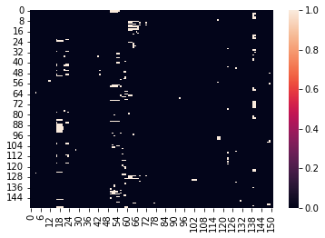
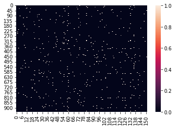

### Kernighan-Lin Heuristic
This code implements the Kernighan-Lin algorithm, described [here](https://ieeexplore.ieee.org/document/6771089), to partition a bipartite graph (weighted or unweighted edges) into a number of specified partitions, with the objective of minimizing the (weighted) sum of edges crossing partitions. 

Since this is simply a heuristic, it does not guarantee an optimal solution and how different parameters impact its performance (KL_modified, random_labels), and how it performs relative to other clustering algorithms, will likely depend on the graph at hand. However, some preliminary benchmarking suggests that the algorithm performs better (with respect to the objective function), when compared to other methods, such as spectral clustering. 

Other algorithms have other objectives; The Leiden clustering algorithm maximizes a "modularity" score [here](https://www.nature.com/articles/s41598-019-41695-z) as its objective function, which quantifies how connected nodes within a partition are compared to a random network. As such, which algorithm we want to use to remove redundancies in our biological pathway databases depends on our biological motivation... [Note: Let's look at how the Kernighan heuristic peforms with regard to modularity.]


### Other Sources: 
[CMU](https://www.cs.cmu.edu/~ckingsf/bioinfo-lectures/kernlin.pdf)\
[Wikipedia](https://en.wikipedia.org/wiki/Kernighan%E2%80%93Lin_algorithm)


### Example run


1. load dependencies


```python
import numpy as np
import gseapy
from scipy.sparse import csr_matrix
from tqdm.contrib.concurrent import process_map
from functools import partial
from scipy.sparse.csgraph import shortest_path
import matplotlib.pyplot as plt
import seaborn as sns

from geneclusters.cluster_genes_new import get_scores, get_kernighan_lin_clusters, get_gene_pathway_matrix, get_full_matrix_from_bipartite
```

2. Download pathway database(s)


```python
# run with internet
x = gseapy.get_library('HumanCyc_2016')
np.save('HumanCyc_2016.npy', x)
```

3. Iterate over multiple initiations


```python
help(get_kernighan_lin_clusters)
```

    Help on function get_kernighan_lin_clusters in module geneclusters.cluster_genes_new:
    
    get_kernighan_lin_clusters(path, threshold, C, KL_modified=True, random_labels=True, unweighted=True, seed=5)
        returns pandas dataframe annotating each gene and pathway to a cluster, based on pathway-gene dictionary and args
        Args:
            path str
                path to pathway-gene dictionary as ndarray
            threshold int
                if random_labels is True, gives number of genes per cluster. Min = 1, Max = total number of genes and pathways
                if random_labels is False, gives number of desired clusters. Min = 1, Max = total number of genes and pathways
            C float
                probability of false negative pathway-gene association (0<=c<= 1)
            KL_modified bool
                whether to run the modified KL algorithm 
            random_labels
                whether to randomize initiating labels or assign based on node centrality
            unweighted bool
                whether to consider weights when computing the shortest path between nodes, only considiered if random_labels is False
    


```python
path = './examples/HumanCyc_2016.npy'
repeats = 500

thresh = np.repeat(30,repeats)
seed = np.arange(repeats)
C = 0
KL_modified = True
random_labels = True
unweighted = True

results = process_map(partial(get_scores,path,C,KL_modified,random_labels,unweighted), seed, thresh)

```


      0%|          | 0/500 [00:00<?, ?it/s]


    3it [00:06,  2.20s/it, tot_impr=1443, last_impr=0, loss=395]   
    3it [00:06,  2.26s/it, tot_impr=1441, last_impr=0, loss=410]   
    3it [00:06,  2.28s/it, tot_impr=1442, last_impr=0, loss=414]   
    3it [00:06,  2.33s/it, tot_impr=1455, last_impr=0, loss=388]   
    3it [00:06,  2.33s/it, tot_impr=1444, last_impr=0, loss=410] 
    3it [00:07,  2.34s/it, tot_impr=1460, last_impr=0, loss=381] 
    3it [00:07,  2.34s/it, tot_impr=1499, last_impr=0, loss=361] 
    4it [00:07,  1.79s/it, tot_impr=1418, last_impr=0, loss=434]
    4it [00:07,  1.80s/it, tot_impr=1400, last_impr=0, loss=445] 
    4it [00:07,  1.80s/it, tot_impr=1463, last_impr=0, loss=382]
    4it [00:07,  1.80s/it, tot_impr=1448, last_impr=0, loss=391]]
    4it [00:07,  1.83s/it, tot_impr=1415, last_impr=0, loss=437] 0]
    3it [00:07,  2.41s/it, tot_impr=1467, last_impr=0, loss=390] 
    4it [00:07,  1.89s/it, tot_impr=1432, last_impr=0, loss=430] 8]
    4it [00:07,  1.90s/it, tot_impr=1409, last_impr=0, loss=444]
    4it [00:07,  1.90s/it, tot_impr=1414, last_impr=0, loss=425]
    4it [00:07,  1.84s/it, tot_impr=1471, last_impr=0, loss=387] 0]
    4it [00:07,  1.91s/it, tot_impr=1435, last_impr=0, loss=423]
    4it [00:07,  1.91s/it, tot_impr=1428, last_impr=0, loss=418] 
    4it [00:07,  1.89s/it, tot_impr=1442, last_impr=0, loss=409]
    4it [00:07,  1.92s/it, tot_impr=1443, last_impr=0, loss=399]
    4it [00:07,  1.96s/it, tot_impr=1416, last_impr=0, loss=447] 3]
    4it [00:07,  1.94s/it, tot_impr=1439, last_impr=0, loss=403]34]
    4it [00:07,  1.94s/it, tot_impr=1472, last_impr=0, loss=383]
    4it [00:08,  2.04s/it, tot_impr=1441, last_impr=0, loss=406]80]
    4it [00:08,  2.04s/it, tot_impr=1467, last_impr=0, loss=380] 4]
    4it [00:08,  2.01s/it, tot_impr=1422, last_impr=0, loss=427]]  
    4it [00:08,  2.04s/it, tot_impr=1454, last_impr=0, loss=393]
    4it [00:08,  2.05s/it, tot_impr=1399, last_impr=0, loss=456]
    4it [00:08,  2.03s/it, tot_impr=1446, last_impr=0, loss=404]   
    5it [00:08,  1.69s/it, tot_impr=1403, last_impr=0, loss=441]]  
    5it [00:08,  1.75s/it, tot_impr=1401, last_impr=0, loss=442]   
    4it [00:02,  1.65it/s, tot_impr=1469, last_impr=0, loss=386]]  
    3it [00:01,  1.55it/s, tot_impr=1435, last_impr=0, loss=416]   
    4it [00:02,  1.58it/s, tot_impr=1467, last_impr=0, loss=389]]  
    3it [00:01,  1.62it/s, tot_impr=1402, last_impr=0, loss=449]   
    3it [00:01,  1.60it/s, tot_impr=1408, last_impr=0, loss=427]   
    3it [00:01,  1.54it/s, tot_impr=1460, last_impr=0, loss=387]   
    4it [00:02,  1.64it/s, tot_impr=1464, last_impr=0, loss=397]
    4it [00:02,  1.63it/s, tot_impr=1477, last_impr=0, loss=378]
    4it [00:02,  1.54it/s, tot_impr=1507, last_impr=0, loss=354]   
    4it [00:02,  1.49it/s, tot_impr=1469, last_impr=0, loss=392]
    4it [00:02,  1.49it/s, tot_impr=1412, last_impr=0, loss=432]
    4it [00:02,  1.59it/s, tot_impr=1478, last_impr=0, loss=360]]9]
    5it [00:03,  1.55it/s, tot_impr=1476, last_impr=0, loss=385]   
    4it [00:02,  1.57it/s, tot_impr=1488, last_impr=0, loss=369]
    4it [00:02,  1.63it/s, tot_impr=1444, last_impr=0, loss=406]   
    5it [00:03,  1.65it/s, tot_impr=1489, last_impr=0, loss=368] 
    4it [00:02,  1.62it/s, tot_impr=1444, last_impr=0, loss=407]
    5it [00:03,  1.56it/s, tot_impr=1411, last_impr=0, loss=431] 
    4it [00:02,  1.59it/s, tot_impr=1418, last_impr=0, loss=434]18]
    4it [00:02,  1.59it/s, tot_impr=1451, last_impr=0, loss=386]89]
    4it [00:02,  1.54it/s, tot_impr=1442, last_impr=0, loss=409] 8]
    4it [00:02,  1.50it/s, tot_impr=1458, last_impr=0, loss=396]
    4it [00:02,  1.54it/s, tot_impr=1419, last_impr=0, loss=418] 
    4it [00:02,  1.58it/s, tot_impr=1435, last_impr=0, loss=410]28]
    4it [00:02,  1.62it/s, tot_impr=1451, last_impr=0, loss=388]
    4it [00:02,  1.58it/s, tot_impr=1426, last_impr=0, loss=415] 4]
    4it [00:02,  1.58it/s, tot_impr=1438, last_impr=0, loss=419]
    4it [00:02,  1.57it/s, tot_impr=1462, last_impr=0, loss=391]06]
    4it [00:02,  1.56it/s, tot_impr=1425, last_impr=0, loss=414]
    4it [00:02,  1.57it/s, tot_impr=1448, last_impr=0, loss=404]63]
    4it [00:02,  1.57it/s, tot_impr=1457, last_impr=0, loss=406]59]
    4it [00:02,  1.57it/s, tot_impr=1454, last_impr=0, loss=398]]  
    4it [00:02,  1.53it/s, tot_impr=1452, last_impr=0, loss=405]]  
    3it [00:01,  1.57it/s, tot_impr=1438, last_impr=0, loss=408]   
    6it [00:03,  1.58it/s, tot_impr=1446, last_impr=0, loss=402]]  
    4it [00:02,  1.69it/s, tot_impr=1485, last_impr=0, loss=383]39]
    4it [00:02,  1.66it/s, tot_impr=1476, last_impr=0, loss=367] 
    4it [00:02,  1.61it/s, tot_impr=1437, last_impr=0, loss=409]   
    4it [00:02,  1.62it/s, tot_impr=1446, last_impr=0, loss=402] 
    4it [00:02,  1.64it/s, tot_impr=1453, last_impr=0, loss=396]61]
    4it [00:02,  1.59it/s, tot_impr=1457, last_impr=0, loss=394] 
    4it [00:02,  1.67it/s, tot_impr=1449, last_impr=0, loss=404]
    5it [00:03,  1.62it/s, tot_impr=1438, last_impr=0, loss=415]92]
    4it [00:02,  1.64it/s, tot_impr=1442, last_impr=0, loss=404]91]
    3it [00:01,  1.55it/s, tot_impr=1415, last_impr=0, loss=430] 
    3it [00:01,  1.52it/s, tot_impr=1391, last_impr=0, loss=465] 
    4it [00:02,  1.67it/s, tot_impr=1453, last_impr=0, loss=400]]  
    4it [00:02,  1.64it/s, tot_impr=1466, last_impr=0, loss=389] 0]
    5it [00:03,  1.62it/s, tot_impr=1501, last_impr=0, loss=356]89]
    4it [00:02,  1.62it/s, tot_impr=1442, last_impr=0, loss=401]84]
    4it [00:02,  1.57it/s, tot_impr=1475, last_impr=0, loss=377]50]
    5it [00:03,  1.65it/s, tot_impr=1437, last_impr=0, loss=409]65]
    5it [00:03,  1.58it/s, tot_impr=1392, last_impr=0, loss=458]
    3it [00:01,  1.62it/s, tot_impr=1474, last_impr=0, loss=366] 
    4it [00:02,  1.54it/s, tot_impr=1474, last_impr=0, loss=376]76]
    4it [00:02,  1.54it/s, tot_impr=1429, last_impr=0, loss=414]7] 
    5it [00:03,  1.59it/s, tot_impr=1458, last_impr=0, loss=406]
    4it [00:02,  1.50it/s, tot_impr=1457, last_impr=0, loss=401]
    4it [00:02,  1.52it/s, tot_impr=1476, last_impr=0, loss=377]]  
    5it [00:03,  1.52it/s, tot_impr=1459, last_impr=0, loss=390]20]
    4it [00:02,  1.58it/s, tot_impr=1430, last_impr=0, loss=409]99]
    3it [00:01,  1.56it/s, tot_impr=1416, last_impr=0, loss=432] 
    5it [00:03,  1.54it/s, tot_impr=1454, last_impr=0, loss=386]]  
    5it [00:03,  1.51it/s, tot_impr=1442, last_impr=0, loss=397]75]
    4it [00:02,  1.61it/s, tot_impr=1438, last_impr=0, loss=408]79]
    4it [00:02,  1.61it/s, tot_impr=1441, last_impr=0, loss=403]90]
    3it [00:01,  1.65it/s, tot_impr=1460, last_impr=0, loss=386] 
    3it [00:01,  1.55it/s, tot_impr=1383, last_impr=0, loss=471] 9]
    4it [00:02,  1.66it/s, tot_impr=1465, last_impr=0, loss=394]]  
    4it [00:02,  1.59it/s, tot_impr=1497, last_impr=0, loss=362]]  
    4it [00:02,  1.60it/s, tot_impr=1434, last_impr=0, loss=417]81]
    4it [00:02,  1.64it/s, tot_impr=1426, last_impr=0, loss=418] 
    4it [00:02,  1.51it/s, tot_impr=1438, last_impr=0, loss=417]]  
    4it [00:02,  1.49it/s, tot_impr=1434, last_impr=0, loss=424]70]
    4it [00:02,  1.62it/s, tot_impr=1492, last_impr=0, loss=363]   
    4it [00:02,  1.48it/s, tot_impr=1408, last_impr=0, loss=435]]2]
    3it [00:01,  1.50it/s, tot_impr=1443, last_impr=0, loss=416] 
    4it [00:02,  1.47it/s, tot_impr=1408, last_impr=0, loss=438]
    4it [00:02,  1.46it/s, tot_impr=1443, last_impr=0, loss=412]]  
    4it [00:02,  1.49it/s, tot_impr=1421, last_impr=0, loss=425]64]
    4it [00:02,  1.64it/s, tot_impr=1452, last_impr=0, loss=401]04]
    4it [00:02,  1.62it/s, tot_impr=1400, last_impr=0, loss=452]   
    4it [00:02,  1.56it/s, tot_impr=1476, last_impr=0, loss=394]98]
    3it [00:02,  1.48it/s, tot_impr=1430, last_impr=0, loss=422] 1]
    5it [00:03,  1.50it/s, tot_impr=1451, last_impr=0, loss=409]01]
    5it [00:03,  1.58it/s, tot_impr=1426, last_impr=0, loss=419]12]
    4it [00:02,  1.55it/s, tot_impr=1438, last_impr=0, loss=404] 9]
    4it [00:02,  1.51it/s, tot_impr=1443, last_impr=0, loss=412]]  
    4it [00:02,  1.49it/s, tot_impr=1447, last_impr=0, loss=412]]  
    5it [00:03,  1.56it/s, tot_impr=1440, last_impr=0, loss=404] 
    4it [00:02,  1.51it/s, tot_impr=1430, last_impr=0, loss=411]
    4it [00:02,  1.51it/s, tot_impr=1458, last_impr=0, loss=396]]  
    4it [00:02,  1.51it/s, tot_impr=1434, last_impr=0, loss=420]]  
    3it [00:02,  1.48it/s, tot_impr=1463, last_impr=0, loss=390]   
    4it [00:02,  1.50it/s, tot_impr=1487, last_impr=0, loss=376]]  
    4it [00:02,  1.52it/s, tot_impr=1437, last_impr=0, loss=425]61]
    5it [00:03,  1.52it/s, tot_impr=1452, last_impr=0, loss=386]]9]
    4it [00:02,  1.63it/s, tot_impr=1460, last_impr=0, loss=383]
    3it [00:01,  1.55it/s, tot_impr=1390, last_impr=0, loss=459] 
    4it [00:02,  1.46it/s, tot_impr=1415, last_impr=0, loss=433]42]
    4it [00:02,  1.45it/s, tot_impr=1430, last_impr=0, loss=413] 0]
    4it [00:02,  1.54it/s, tot_impr=1455, last_impr=0, loss=391]53]
    4it [00:02,  1.46it/s, tot_impr=1448, last_impr=0, loss=410]   
    4it [00:02,  1.51it/s, tot_impr=1445, last_impr=0, loss=393]
    4it [00:02,  1.52it/s, tot_impr=1397, last_impr=0, loss=454]]  
    4it [00:02,  1.58it/s, tot_impr=1446, last_impr=0, loss=409] 6]
    4it [00:02,  1.63it/s, tot_impr=1454, last_impr=0, loss=407]
    4it [00:02,  1.59it/s, tot_impr=1436, last_impr=0, loss=407]]  
    4it [00:02,  1.58it/s, tot_impr=1428, last_impr=0, loss=427]77]
    4it [00:02,  1.58it/s, tot_impr=1422, last_impr=0, loss=433]
    4it [00:02,  1.63it/s, tot_impr=1479, last_impr=0, loss=367]07]
    4it [00:02,  1.66it/s, tot_impr=1439, last_impr=0, loss=399]   
    4it [00:02,  1.54it/s, tot_impr=1463, last_impr=0, loss=381]
    4it [00:02,  1.63it/s, tot_impr=1445, last_impr=0, loss=412]]  
    3it [00:01,  1.62it/s, tot_impr=1428, last_impr=0, loss=424] 2]
    4it [00:02,  1.57it/s, tot_impr=1430, last_impr=0, loss=420]]  
    4it [00:02,  1.50it/s, tot_impr=1466, last_impr=0, loss=393]81]
    4it [00:02,  1.48it/s, tot_impr=1460, last_impr=0, loss=397]02]
    4it [00:02,  1.50it/s, tot_impr=1433, last_impr=0, loss=417]
    4it [00:02,  1.48it/s, tot_impr=1481, last_impr=0, loss=363]]  
    4it [00:02,  1.61it/s, tot_impr=1479, last_impr=0, loss=376]
    3it [00:02,  1.44it/s, tot_impr=1424, last_impr=0, loss=424] 7]
    4it [00:02,  1.43it/s, tot_impr=1374, last_impr=0, loss=462]
    4it [00:02,  1.42it/s, tot_impr=1453, last_impr=0, loss=396]22]
    4it [00:02,  1.50it/s, tot_impr=1442, last_impr=0, loss=404]   
    4it [00:02,  1.42it/s, tot_impr=1383, last_impr=0, loss=465]]0]
    4it [00:02,  1.62it/s, tot_impr=1457, last_impr=0, loss=394]]  
    4it [00:02,  1.43it/s, tot_impr=1436, last_impr=0, loss=417]24]
    4it [00:02,  1.61it/s, tot_impr=1449, last_impr=0, loss=398]64]
    5it [00:03,  1.47it/s, tot_impr=1460, last_impr=0, loss=380] 9]
    4it [00:02,  1.63it/s, tot_impr=1451, last_impr=0, loss=400]
    4it [00:02,  1.53it/s, tot_impr=1449, last_impr=0, loss=402]
    3it [00:01,  1.61it/s, tot_impr=1429, last_impr=0, loss=419]75]
    6it [00:03,  1.62it/s, tot_impr=1443, last_impr=0, loss=405]   
    4it [00:02,  1.55it/s, tot_impr=1439, last_impr=0, loss=424]12]
    4it [00:02,  1.53it/s, tot_impr=1429, last_impr=0, loss=419] 4]
    4it [00:02,  1.64it/s, tot_impr=1466, last_impr=0, loss=390] 2]
    4it [00:02,  1.53it/s, tot_impr=1456, last_impr=0, loss=399]   
    4it [00:02,  1.55it/s, tot_impr=1473, last_impr=0, loss=383] 
    4it [00:02,  1.54it/s, tot_impr=1463, last_impr=0, loss=398]]  
    3it [00:01,  1.50it/s, tot_impr=1416, last_impr=0, loss=444] 
    5it [00:03,  1.53it/s, tot_impr=1410, last_impr=0, loss=443]
    4it [00:02,  1.55it/s, tot_impr=1387, last_impr=0, loss=464]
    4it [00:02,  1.53it/s, tot_impr=1394, last_impr=0, loss=466]
    4it [00:02,  1.62it/s, tot_impr=1438, last_impr=0, loss=413]65]
    3it [00:01,  1.59it/s, tot_impr=1443, last_impr=0, loss=416]   
    4it [00:02,  1.59it/s, tot_impr=1404, last_impr=0, loss=444]42]
    3it [00:01,  1.52it/s, tot_impr=1460, last_impr=0, loss=402] 4]
    4it [00:02,  1.43it/s, tot_impr=1462, last_impr=0, loss=388]50]
    3it [00:02,  1.44it/s, tot_impr=1395, last_impr=0, loss=459] 3]
    4it [00:02,  1.48it/s, tot_impr=1432, last_impr=0, loss=412]79]
    4it [00:02,  1.60it/s, tot_impr=1418, last_impr=0, loss=422]81]
    4it [00:02,  1.60it/s, tot_impr=1455, last_impr=0, loss=392]
    3it [00:02,  1.45it/s, tot_impr=1418, last_impr=0, loss=430]   
    4it [00:02,  1.45it/s, tot_impr=1455, last_impr=0, loss=410] 
    4it [00:02,  1.49it/s, tot_impr=1428, last_impr=0, loss=419]]  
    4it [00:02,  1.63it/s, tot_impr=1447, last_impr=0, loss=397]   
    5it [00:03,  1.46it/s, tot_impr=1373, last_impr=0, loss=465]]  
    4it [00:02,  1.50it/s, tot_impr=1444, last_impr=0, loss=402]]  
    3it [00:02,  1.48it/s, tot_impr=1446, last_impr=0, loss=399] 7]
    5it [00:03,  1.55it/s, tot_impr=1462, last_impr=0, loss=386]
    3it [00:01,  1.55it/s, tot_impr=1463, last_impr=0, loss=402] 
    4it [00:02,  1.53it/s, tot_impr=1420, last_impr=0, loss=429]85]
    4it [00:02,  1.51it/s, tot_impr=1472, last_impr=0, loss=377]]  
    4it [00:02,  1.61it/s, tot_impr=1453, last_impr=0, loss=402]
    5it [00:03,  1.63it/s, tot_impr=1394, last_impr=0, loss=442]   
    4it [00:02,  1.62it/s, tot_impr=1453, last_impr=0, loss=397]
    4it [00:02,  1.51it/s, tot_impr=1493, last_impr=0, loss=371]05]
    3it [00:01,  1.63it/s, tot_impr=1477, last_impr=0, loss=373] 
    4it [00:02,  1.61it/s, tot_impr=1458, last_impr=0, loss=393]]  
    5it [00:03,  1.48it/s, tot_impr=1455, last_impr=0, loss=386]
    4it [00:02,  1.55it/s, tot_impr=1394, last_impr=0, loss=446]
    4it [00:02,  1.43it/s, tot_impr=1462, last_impr=0, loss=382]99]
    4it [00:02,  1.44it/s, tot_impr=1436, last_impr=0, loss=405]99]
    4it [00:02,  1.47it/s, tot_impr=1442, last_impr=0, loss=413]]  
    4it [00:02,  1.47it/s, tot_impr=1462, last_impr=0, loss=384]
    4it [00:02,  1.53it/s, tot_impr=1474, last_impr=0, loss=379] 8]
    3it [00:01,  1.65it/s, tot_impr=1441, last_impr=0, loss=411]]  
    4it [00:02,  1.50it/s, tot_impr=1450, last_impr=0, loss=397] 9]
    5it [00:03,  1.47it/s, tot_impr=1452, last_impr=0, loss=401]]  
    4it [00:02,  1.54it/s, tot_impr=1409, last_impr=0, loss=451]84]
    5it [00:03,  1.63it/s, tot_impr=1400, last_impr=0, loss=433]
    3it [00:01,  1.50it/s, tot_impr=1439, last_impr=0, loss=419]   
    4it [00:02,  1.63it/s, tot_impr=1471, last_impr=0, loss=388]43]
    3it [00:01,  1.53it/s, tot_impr=1482, last_impr=0, loss=374] 
    4it [00:02,  1.53it/s, tot_impr=1384, last_impr=0, loss=444] 4]
    4it [00:02,  1.53it/s, tot_impr=1445, last_impr=0, loss=399]   
    4it [00:02,  1.53it/s, tot_impr=1443, last_impr=0, loss=418]26]
    4it [00:02,  1.66it/s, tot_impr=1449, last_impr=0, loss=399] 7]
    4it [00:02,  1.59it/s, tot_impr=1488, last_impr=0, loss=370]]  
    4it [00:02,  1.58it/s, tot_impr=1481, last_impr=0, loss=382]6] 
    4it [00:02,  1.52it/s, tot_impr=1438, last_impr=0, loss=417]37]
    4it [00:02,  1.58it/s, tot_impr=1440, last_impr=0, loss=416] 1]
    4it [00:02,  1.47it/s, tot_impr=1444, last_impr=0, loss=399]]  
    4it [00:02,  1.42it/s, tot_impr=1438, last_impr=0, loss=409]26]
    4it [00:02,  1.44it/s, tot_impr=1450, last_impr=0, loss=391]   
    3it [00:02,  1.46it/s, tot_impr=1479, last_impr=0, loss=373] 
    4it [00:02,  1.60it/s, tot_impr=1431, last_impr=0, loss=415] 
    4it [00:02,  1.64it/s, tot_impr=1425, last_impr=0, loss=423]]  
    5it [00:03,  1.50it/s, tot_impr=1463, last_impr=0, loss=395]31]
    4it [00:02,  1.48it/s, tot_impr=1447, last_impr=0, loss=400]   
    4it [00:02,  1.56it/s, tot_impr=1439, last_impr=0, loss=415]   
    4it [00:02,  1.57it/s, tot_impr=1453, last_impr=0, loss=388]43]
    4it [00:02,  1.66it/s, tot_impr=1436, last_impr=0, loss=413]
    4it [00:02,  1.57it/s, tot_impr=1425, last_impr=0, loss=419]]
    7it [00:04,  1.54it/s, tot_impr=1464, last_impr=0, loss=395]54]
    6it [00:03,  1.51it/s, tot_impr=1421, last_impr=0, loss=421]
    4it [00:02,  1.55it/s, tot_impr=1456, last_impr=0, loss=397]66]
    5it [00:03,  1.52it/s, tot_impr=1462, last_impr=0, loss=389]]  
    4it [00:02,  1.64it/s, tot_impr=1422, last_impr=0, loss=437]90]
    5it [00:03,  1.65it/s, tot_impr=1435, last_impr=0, loss=412] 
    4it [00:02,  1.55it/s, tot_impr=1381, last_impr=0, loss=455] 
    4it [00:02,  1.57it/s, tot_impr=1466, last_impr=0, loss=393]
    3it [00:01,  1.60it/s, tot_impr=1468, last_impr=0, loss=380]   
    4it [00:02,  1.55it/s, tot_impr=1428, last_impr=0, loss=424]
    4it [00:02,  1.61it/s, tot_impr=1466, last_impr=0, loss=388]44]
    4it [00:02,  1.53it/s, tot_impr=1465, last_impr=0, loss=386] 5]
    4it [00:02,  1.53it/s, tot_impr=1424, last_impr=0, loss=420]46]
    4it [00:02,  1.50it/s, tot_impr=1448, last_impr=0, loss=398]]  
    3it [00:01,  1.59it/s, tot_impr=1424, last_impr=0, loss=418]   
    5it [00:03,  1.45it/s, tot_impr=1445, last_impr=0, loss=403]70]
    3it [00:02,  1.46it/s, tot_impr=1435, last_impr=0, loss=404]   
    4it [00:02,  1.42it/s, tot_impr=1416, last_impr=0, loss=425]   
    4it [00:02,  1.42it/s, tot_impr=1462, last_impr=0, loss=383]]  
    4it [00:02,  1.58it/s, tot_impr=1427, last_impr=0, loss=415]51]
    4it [00:02,  1.46it/s, tot_impr=1449, last_impr=0, loss=390]]4]
    6it [00:03,  1.52it/s, tot_impr=1464, last_impr=0, loss=390] 
    5it [00:03,  1.61it/s, tot_impr=1461, last_impr=0, loss=401] 
    4it [00:02,  1.51it/s, tot_impr=1450, last_impr=0, loss=388]]  
    3it [00:02,  1.41it/s, tot_impr=1453, last_impr=0, loss=408]   
    4it [00:02,  1.61it/s, tot_impr=1419, last_impr=0, loss=436]]
    3it [00:01,  1.59it/s, tot_impr=1453, last_impr=0, loss=394]06]
    4it [00:02,  1.54it/s, tot_impr=1452, last_impr=0, loss=399] 8]
    3it [00:01,  1.58it/s, tot_impr=1452, last_impr=0, loss=404]]  
    4it [00:02,  1.55it/s, tot_impr=1449, last_impr=0, loss=403] 
    4it [00:02,  1.47it/s, tot_impr=1469, last_impr=0, loss=383]69]
    4it [00:02,  1.45it/s, tot_impr=1388, last_impr=0, loss=450]3] 
    4it [00:02,  1.56it/s, tot_impr=1489, last_impr=0, loss=366]   
    4it [00:02,  1.47it/s, tot_impr=1474, last_impr=0, loss=385] 
    5it [00:03,  1.51it/s, tot_impr=1464, last_impr=0, loss=395]]  
    4it [00:02,  1.46it/s, tot_impr=1406, last_impr=0, loss=444]  
    6it [00:04,  1.47it/s, tot_impr=1456, last_impr=0, loss=390]35]
    5it [00:03,  1.59it/s, tot_impr=1478, last_impr=0, loss=370] 
    4it [00:02,  1.43it/s, tot_impr=1464, last_impr=0, loss=380]]  
    5it [00:03,  1.49it/s, tot_impr=1488, last_impr=0, loss=370]69]
    5it [00:03,  1.49it/s, tot_impr=1478, last_impr=0, loss=379] 6]
    4it [00:02,  1.36it/s, tot_impr=1440, last_impr=0, loss=426]
    4it [00:02,  1.35it/s, tot_impr=1474, last_impr=0, loss=382]60]
    5it [00:03,  1.38it/s, tot_impr=1446, last_impr=0, loss=397]
    3it [00:01,  1.60it/s, tot_impr=1465, last_impr=0, loss=397]   
    3it [00:02,  1.44it/s, tot_impr=1438, last_impr=0, loss=398]]  
    4it [00:02,  1.44it/s, tot_impr=1455, last_impr=0, loss=383]]  
    4it [00:02,  1.48it/s, tot_impr=1460, last_impr=0, loss=392]44]
    4it [00:02,  1.44it/s, tot_impr=1459, last_impr=0, loss=390] 8]
    6it [00:04,  1.42it/s, tot_impr=1444, last_impr=0, loss=414]]  
    4it [00:02,  1.51it/s, tot_impr=1452, last_impr=0, loss=399]
    4it [00:02,  1.51it/s, tot_impr=1460, last_impr=0, loss=381]]  
    4it [00:02,  1.61it/s, tot_impr=1426, last_impr=0, loss=444]
    5it [00:03,  1.46it/s, tot_impr=1427, last_impr=0, loss=419]   
    4it [00:02,  1.60it/s, tot_impr=1471, last_impr=0, loss=391]63]
    4it [00:02,  1.49it/s, tot_impr=1451, last_impr=0, loss=410]15]
    4it [00:02,  1.51it/s, tot_impr=1452, last_impr=0, loss=398] 
    4it [00:02,  1.63it/s, tot_impr=1457, last_impr=0, loss=396]
    4it [00:02,  1.49it/s, tot_impr=1459, last_impr=0, loss=391]78]
    3it [00:02,  1.47it/s, tot_impr=1426, last_impr=0, loss=417] 4]
    4it [00:02,  1.49it/s, tot_impr=1347, last_impr=0, loss=494]]  
    4it [00:02,  1.57it/s, tot_impr=1466, last_impr=0, loss=388]04]
    5it [00:03,  1.62it/s, tot_impr=1439, last_impr=0, loss=413]]  
    4it [00:02,  1.40it/s, tot_impr=1462, last_impr=0, loss=380]   
    4it [00:02,  1.39it/s, tot_impr=1461, last_impr=0, loss=388]]  
    3it [00:01,  1.61it/s, tot_impr=1500, last_impr=0, loss=356] 
    4it [00:02,  1.47it/s, tot_impr=1378, last_impr=0, loss=464]62]
    5it [00:03,  1.60it/s, tot_impr=1423, last_impr=0, loss=426]]  
    4it [00:02,  1.40it/s, tot_impr=1436, last_impr=0, loss=418]
    3it [00:02,  1.39it/s, tot_impr=1402, last_impr=0, loss=447] ] 
    4it [00:02,  1.41it/s, tot_impr=1376, last_impr=0, loss=480]
    3it [00:02,  1.43it/s, tot_impr=1407, last_impr=0, loss=442] 
    4it [00:02,  1.38it/s, tot_impr=1478, last_impr=0, loss=379]
    4it [00:03,  1.32it/s, tot_impr=1412, last_impr=0, loss=441]
    4it [00:02,  1.61it/s, tot_impr=1457, last_impr=0, loss=399]
    4it [00:02,  1.56it/s, tot_impr=1428, last_impr=0, loss=426]3] 
    4it [00:02,  1.61it/s, tot_impr=1443, last_impr=0, loss=413]] ]
    6it [00:04,  1.42it/s, tot_impr=1486, last_impr=0, loss=372]]  
    3it [00:02,  1.40it/s, tot_impr=1427, last_impr=0, loss=423]  ]
    4it [00:02,  1.44it/s, tot_impr=1426, last_impr=0, loss=418]93]
    4it [00:02,  1.44it/s, tot_impr=1484, last_impr=0, loss=372] 
    4it [00:02,  1.44it/s, tot_impr=1448, last_impr=0, loss=413]03]
    4it [00:02,  1.47it/s, tot_impr=1417, last_impr=0, loss=424]
    4it [00:02,  1.61it/s, tot_impr=1458, last_impr=0, loss=394]81]
    4it [00:02,  1.44it/s, tot_impr=1468, last_impr=0, loss=378]
    4it [00:02,  1.46it/s, tot_impr=1466, last_impr=0, loss=365] 
    4it [00:02,  1.48it/s, tot_impr=1388, last_impr=0, loss=458]
    4it [00:02,  1.44it/s, tot_impr=1451, last_impr=0, loss=407]   
    4it [00:02,  1.44it/s, tot_impr=1439, last_impr=0, loss=404]]  
    4it [00:02,  1.40it/s, tot_impr=1456, last_impr=0, loss=391] 
    5it [00:03,  1.63it/s, tot_impr=1442, last_impr=0, loss=411]54]
    4it [00:02,  1.47it/s, tot_impr=1445, last_impr=0, loss=405]35]
    4it [00:02,  1.54it/s, tot_impr=1464, last_impr=0, loss=387] 
    3it [00:02,  1.47it/s, tot_impr=1446, last_impr=0, loss=401]   
    4it [00:02,  1.47it/s, tot_impr=1460, last_impr=0, loss=407]]  
    4it [00:02,  1.62it/s, tot_impr=1432, last_impr=0, loss=410]
    5it [00:03,  1.40it/s, tot_impr=1452, last_impr=0, loss=403]]  
    4it [00:02,  1.50it/s, tot_impr=1370, last_impr=0, loss=470]
    4it [00:02,  1.47it/s, tot_impr=1464, last_impr=0, loss=390]59]
    5it [00:03,  1.63it/s, tot_impr=1471, last_impr=0, loss=389]]  
    3it [00:02,  1.50it/s, tot_impr=1421, last_impr=0, loss=430]   
    4it [00:02,  1.49it/s, tot_impr=1442, last_impr=0, loss=412]
    4it [00:02,  1.64it/s, tot_impr=1397, last_impr=0, loss=460]
    4it [00:02,  1.53it/s, tot_impr=1409, last_impr=0, loss=450] 
    4it [00:02,  1.61it/s, tot_impr=1452, last_impr=0, loss=408]
    4it [00:02,  1.53it/s, tot_impr=1407, last_impr=0, loss=434]]
    4it [00:02,  1.60it/s, tot_impr=1459, last_impr=0, loss=396]   
    3it [00:01,  1.50it/s, tot_impr=1468, last_impr=0, loss=377]   
    3it [00:02,  1.48it/s, tot_impr=1472, last_impr=0, loss=378]]  
    3it [00:02,  1.47it/s, tot_impr=1448, last_impr=0, loss=411] 8]
    5it [00:03,  1.62it/s, tot_impr=1460, last_impr=0, loss=388]
    5it [00:03,  1.50it/s, tot_impr=1426, last_impr=0, loss=424]
    4it [00:02,  1.54it/s, tot_impr=1398, last_impr=0, loss=450] 9]
    4it [00:02,  1.52it/s, tot_impr=1432, last_impr=0, loss=420]74]
    4it [00:02,  1.55it/s, tot_impr=1476, last_impr=0, loss=375]  
    4it [00:02,  1.51it/s, tot_impr=1393, last_impr=0, loss=446]
    4it [00:02,  1.52it/s, tot_impr=1456, last_impr=0, loss=398] 8]
    4it [00:02,  1.52it/s, tot_impr=1448, last_impr=0, loss=390] 
    3it [00:01,  1.62it/s, tot_impr=1438, last_impr=0, loss=401] 
    6it [00:03,  1.56it/s, tot_impr=1449, last_impr=0, loss=401]19]
    4it [00:02,  1.51it/s, tot_impr=1457, last_impr=0, loss=400]]  
    4it [00:02,  1.48it/s, tot_impr=1418, last_impr=0, loss=444]]  
    4it [00:02,  1.51it/s, tot_impr=1474, last_impr=0, loss=373]82]
    4it [00:02,  1.51it/s, tot_impr=1432, last_impr=0, loss=422]74]
    5it [00:03,  1.41it/s, tot_impr=1456, last_impr=0, loss=398]
    4it [00:02,  1.51it/s, tot_impr=1442, last_impr=0, loss=400]]  
    4it [00:02,  1.61it/s, tot_impr=1472, last_impr=0, loss=380]   
    3it [00:02,  1.49it/s, tot_impr=1426, last_impr=0, loss=420]   
    4it [00:02,  1.54it/s, tot_impr=1450, last_impr=0, loss=393]]  
    3it [00:01,  1.62it/s, tot_impr=1450, last_impr=0, loss=400] 
    3it [00:02,  1.47it/s, tot_impr=1430, last_impr=0, loss=425] 9]
    4it [00:02,  1.52it/s, tot_impr=1410, last_impr=0, loss=429]77]
    4it [00:02,  1.53it/s, tot_impr=1399, last_impr=0, loss=450]
    4it [00:02,  1.52it/s, tot_impr=1409, last_impr=0, loss=438] 
    4it [00:02,  1.55it/s, tot_impr=1419, last_impr=0, loss=423]
    4it [00:02,  1.54it/s, tot_impr=1440, last_impr=0, loss=406]]  
    5it [00:03,  1.56it/s, tot_impr=1451, last_impr=0, loss=403]]  
    4it [00:02,  1.53it/s, tot_impr=1472, last_impr=0, loss=386]
    3it [00:02,  1.48it/s, tot_impr=1410, last_impr=0, loss=443] 
    5it [00:03,  1.55it/s, tot_impr=1479, last_impr=0, loss=371]
    5it [00:03,  1.56it/s, tot_impr=1436, last_impr=0, loss=429]
    5it [00:03,  1.59it/s, tot_impr=1443, last_impr=0, loss=415]44]
    5it [00:03,  1.55it/s, tot_impr=1470, last_impr=0, loss=392]
    4it [00:02,  1.47it/s, tot_impr=1452, last_impr=0, loss=399] 1]
    3it [00:01,  1.63it/s, tot_impr=1420, last_impr=0, loss=432] 3]
    4it [00:02,  1.47it/s, tot_impr=1442, last_impr=0, loss=399] 4]
    4it [00:02,  1.52it/s, tot_impr=1455, last_impr=0, loss=399]
    4it [00:02,  1.44it/s, tot_impr=1416, last_impr=0, loss=437]   
    3it [00:01,  1.65it/s, tot_impr=1446, last_impr=0, loss=404] 
    4it [00:02,  1.41it/s, tot_impr=1474, last_impr=0, loss=390] 9]
    5it [00:03,  1.51it/s, tot_impr=1467, last_impr=0, loss=389]   
    4it [00:02,  1.45it/s, tot_impr=1468, last_impr=0, loss=387]74]
    4it [00:02,  1.45it/s, tot_impr=1464, last_impr=0, loss=390]69]
    4it [00:02,  1.64it/s, tot_impr=1399, last_impr=0, loss=446]42]
    5it [00:03,  1.45it/s, tot_impr=1425, last_impr=0, loss=408]
    5it [00:03,  1.48it/s, tot_impr=1403, last_impr=0, loss=433] 
    4it [00:02,  1.59it/s, tot_impr=1407, last_impr=0, loss=437]]  
    4it [00:02,  1.46it/s, tot_impr=1478, last_impr=0, loss=375]]  
    4it [00:02,  1.50it/s, tot_impr=1439, last_impr=0, loss=410]83]
    5it [00:03,  1.55it/s, tot_impr=1436, last_impr=0, loss=412]12]
    3it [00:02,  1.45it/s, tot_impr=1417, last_impr=0, loss=439] 
    3it [00:01,  1.62it/s, tot_impr=1432, last_impr=0, loss=410]]  
    4it [00:02,  1.64it/s, tot_impr=1429, last_impr=0, loss=408] ] 
    4it [00:02,  1.64it/s, tot_impr=1426, last_impr=0, loss=418] 
    4it [00:02,  1.48it/s, tot_impr=1457, last_impr=0, loss=395] 
    4it [00:02,  1.47it/s, tot_impr=1415, last_impr=0, loss=421]]  
    4it [00:02,  1.51it/s, tot_impr=1461, last_impr=0, loss=391]
    4it [00:02,  1.42it/s, tot_impr=1434, last_impr=0, loss=418] 
    4it [00:02,  1.50it/s, tot_impr=1439, last_impr=0, loss=417]
    3it [00:02,  1.48it/s, tot_impr=1451, last_impr=0, loss=396] 
    3it [00:01,  1.50it/s, tot_impr=1410, last_impr=0, loss=445] 7]
    4it [00:02,  1.46it/s, tot_impr=1408, last_impr=0, loss=446]
    4it [00:02,  1.44it/s, tot_impr=1470, last_impr=0, loss=388]
    4it [00:02,  1.42it/s, tot_impr=1465, last_impr=0, loss=384]]  
    3it [00:01,  1.51it/s, tot_impr=1464, last_impr=0, loss=390]  
    4it [00:02,  1.40it/s, tot_impr=1450, last_impr=0, loss=402] 2]
    4it [00:02,  1.57it/s, tot_impr=1434, last_impr=0, loss=413]88]
    4it [00:02,  1.57it/s, tot_impr=1437, last_impr=0, loss=415]46]
    4it [00:02,  1.42it/s, tot_impr=1429, last_impr=0, loss=422]
    4it [00:02,  1.52it/s, tot_impr=1442, last_impr=0, loss=391]] ]
    3it [00:01,  1.55it/s, tot_impr=1442, last_impr=0, loss=402]  
    5it [00:03,  1.42it/s, tot_impr=1472, last_impr=0, loss=384]
    3it [00:02,  1.46it/s, tot_impr=1395, last_impr=0, loss=453]   
    4it [00:02,  1.64it/s, tot_impr=1453, last_impr=0, loss=398]]7]
    4it [00:02,  1.56it/s, tot_impr=1433, last_impr=0, loss=419]
    5it [00:03,  1.53it/s, tot_impr=1443, last_impr=0, loss=404]47]
    5it [00:03,  1.66it/s, tot_impr=1449, last_impr=0, loss=395]
    3it [00:01,  1.60it/s, tot_impr=1460, last_impr=0, loss=400]   
    4it [00:02,  1.60it/s, tot_impr=1465, last_impr=0, loss=384]   
    5it [00:03,  1.59it/s, tot_impr=1457, last_impr=0, loss=380]
    3it [00:02,  1.46it/s, tot_impr=1414, last_impr=0, loss=446]   
    3it [00:01,  1.59it/s, tot_impr=1434, last_impr=0, loss=421]   
    4it [00:02,  1.56it/s, tot_impr=1460, last_impr=0, loss=398]
    4it [00:02,  1.70it/s, tot_impr=1452, last_impr=0, loss=405]80]
    4it [00:02,  1.62it/s, tot_impr=1463, last_impr=0, loss=393]32]
    4it [00:02,  1.61it/s, tot_impr=1440, last_impr=0, loss=407] 
    4it [00:02,  1.62it/s, tot_impr=1469, last_impr=0, loss=379] 
    4it [00:02,  1.57it/s, tot_impr=1434, last_impr=0, loss=420]
    4it [00:02,  1.61it/s, tot_impr=1470, last_impr=0, loss=377] 
    3it [00:01,  1.68it/s, tot_impr=1468, last_impr=0, loss=386]   
    4it [00:02,  1.62it/s, tot_impr=1440, last_impr=0, loss=415] 
    4it [00:02,  1.54it/s, tot_impr=1471, last_impr=0, loss=379] 
    4it [00:02,  1.75it/s, tot_impr=1464, last_impr=0, loss=392]]  
    4it [00:02,  1.66it/s, tot_impr=1445, last_impr=0, loss=409]77]
    4it [00:02,  1.67it/s, tot_impr=1467, last_impr=0, loss=383] 1]
    4it [00:02,  1.67it/s, tot_impr=1423, last_impr=0, loss=432]58]
    5it [00:03,  1.59it/s, tot_impr=1457, last_impr=0, loss=401]
    4it [00:02,  1.64it/s, tot_impr=1457, last_impr=0, loss=393]
    4it [00:02,  1.77it/s, tot_impr=1485, last_impr=0, loss=365]
    4it [00:02,  1.65it/s, tot_impr=1453, last_impr=0, loss=395]]  
    4it [00:02,  1.75it/s, tot_impr=1464, last_impr=0, loss=400]
    4it [00:02,  1.67it/s, tot_impr=1415, last_impr=0, loss=431]]  
    3it [00:01,  1.74it/s, tot_impr=1450, last_impr=0, loss=402]   
    5it [00:02,  1.74it/s, tot_impr=1448, last_impr=0, loss=394]]  
    5it [00:02,  1.76it/s, tot_impr=1476, last_impr=0, loss=384]77]
    4it [00:02,  1.67it/s, tot_impr=1423, last_impr=0, loss=417] 8]
    4it [00:02,  1.67it/s, tot_impr=1420, last_impr=0, loss=427] 5]
    4it [00:02,  1.73it/s, tot_impr=1458, last_impr=0, loss=383]]
    3it [00:01,  1.75it/s, tot_impr=1483, last_impr=0, loss=355] 
    5it [00:03,  1.65it/s, tot_impr=1390, last_impr=0, loss=463]48]
    4it [00:02,  1.75it/s, tot_impr=1416, last_impr=0, loss=424]]  
    4it [00:02,  1.65it/s, tot_impr=1447, last_impr=0, loss=400]24]
    4it [00:02,  1.66it/s, tot_impr=1442, last_impr=0, loss=414]]  
    4it [00:02,  1.66it/s, tot_impr=1419, last_impr=0, loss=425] 
    4it [00:02,  1.76it/s, tot_impr=1423, last_impr=0, loss=429]]  
    4it [00:02,  1.66it/s, tot_impr=1468, last_impr=0, loss=379]
    4it [00:02,  1.76it/s, tot_impr=1503, last_impr=0, loss=363]87]
    3it [00:01,  1.66it/s, tot_impr=1410, last_impr=0, loss=449] 
    3it [00:01,  1.66it/s, tot_impr=1432, last_impr=0, loss=422] 2]
    4it [00:02,  1.60it/s, tot_impr=1435, last_impr=0, loss=422]   
    5it [00:02,  1.77it/s, tot_impr=1467, last_impr=0, loss=375] 
    4it [00:02,  1.76it/s, tot_impr=1464, last_impr=0, loss=395] 3]
    5it [00:02,  1.76it/s, tot_impr=1446, last_impr=0, loss=389]81]
    5it [00:03,  1.65it/s, tot_impr=1484, last_impr=0, loss=381]]  
    5it [00:02,  1.73it/s, tot_impr=1444, last_impr=0, loss=399]]  
    3it [00:01,  1.74it/s, tot_impr=1373, last_impr=0, loss=477] 2]
    4it [00:02,  1.67it/s, tot_impr=1499, last_impr=0, loss=350]   
    5it [00:02,  1.67it/s, tot_impr=1498, last_impr=0, loss=356]20]
    4it [00:02,  1.68it/s, tot_impr=1445, last_impr=0, loss=406]]  
    4it [00:02,  1.76it/s, tot_impr=1472, last_impr=0, loss=398] 4]
    6it [00:03,  1.77it/s, tot_impr=1509, last_impr=0, loss=349]81]
    4it [00:02,  1.67it/s, tot_impr=1454, last_impr=0, loss=409]
    4it [00:02,  1.76it/s, tot_impr=1487, last_impr=0, loss=367]   
    4it [00:02,  1.69it/s, tot_impr=1433, last_impr=0, loss=419] 4]
    5it [00:02,  1.68it/s, tot_impr=1404, last_impr=0, loss=444]]  
    4it [00:02,  1.77it/s, tot_impr=1477, last_impr=0, loss=374]]  
    3it [00:01,  1.74it/s, tot_impr=1470, last_impr=0, loss=379]   
    3it [00:01,  1.74it/s, tot_impr=1421, last_impr=0, loss=438] 
    3it [00:01,  1.75it/s, tot_impr=1416, last_impr=0, loss=429] 
    4it [00:02,  1.72it/s, tot_impr=1471, last_impr=0, loss=381]]  
    4it [00:02,  1.78it/s, tot_impr=1446, last_impr=0, loss=397]]  
    4it [00:02,  1.73it/s, tot_impr=1447, last_impr=0, loss=397]  
    3it [00:01,  1.80it/s, tot_impr=1441, last_impr=0, loss=416] 
    5it [00:02,  1.79it/s, tot_impr=1446, last_impr=0, loss=406] 
    4it [00:02,  1.80it/s, tot_impr=1458, last_impr=0, loss=399]
    5it [00:02,  1.74it/s, tot_impr=1419, last_impr=0, loss=423]
    3it [00:01,  1.81it/s, tot_impr=1407, last_impr=0, loss=433] 
    7it [00:03,  1.80it/s, tot_impr=1443, last_impr=0, loss=395] 
    4it [00:02,  1.79it/s, tot_impr=1478, last_impr=0, loss=375] 
    4it [00:02,  1.81it/s, tot_impr=1437, last_impr=0, loss=415]
    4it [00:02,  1.82it/s, tot_impr=1418, last_impr=0, loss=427]
    5it [00:02,  1.78it/s, tot_impr=1465, last_impr=0, loss=385] 
    6it [00:03,  1.81it/s, tot_impr=1466, last_impr=0, loss=392]


4. Select labels from the best loss


```python
loss = np.hstack([x[1] for x in results])
labs = np.vstack([x[0] for x in results])
labels = labs[np.argmin(loss)]
```


```python
# assign the clusters
frame, loss_temp = get_kernighan_lin_clusters(path, 30, C, KL_modified, random_labels, unweighted, seed=seed[np.argmin(loss)])
frame.columns = ['cluster', 'description', 'is_gene']

```

    6it [00:07,  1.19s/it, tot_impr=1509, last_impr=0, loss=349]   


```python
frame[frame['cluster']==23]['description']
```


    11                                                 ACAD8
    13                                                ACADSB
    90                                               ALDH6A1
    135                                                  AUH
    147                                                BCAT1
    148                                                BCAT2
    149                                               BCKDHA
    150                                               BCKDHB
    243                                                  DBT
    261                                                  DLD
    277                                                ECHS1
    426                                                HADHA
    434                                               HIBADH
    435                                                HIBCH
    442                                              HMGCLL1
    461                                             HSD17B10
    509                                                  IVD
    543                                                MCCC1
    544                                                MCCC2
    624                                                PDHA1
    625                                                PDHA2
    796                                                  SDS
    797                                                 SDSL
    972    pyruvate decarboxylation to acetyl CoA Homo sa...
    974     2-oxobutanoate degradation Homo sapiens PWY-5130
    975         threonine degradation Homo sapiens PWY66-428
    976        leucine degradation Homo sapiens LEU-DEG2-PWY
    977      isoleucine degradation Homo sapiens ILEUDEG-PWY
    978           valine degradation Homo sapiens VALDEG-PWY
    Name: description, dtype: object


5. Order matrix entries by labeling


```python
mat = get_gene_pathway_matrix('./examples/HumanCyc_2016.npy')
matrix = np.ascontiguousarray(mat.values.T)
```


```python
sns.heatmap(matrix[np.argsort(frame[frame['is_gene']]['cluster'])][np.argsort(frame[np.invert(frame['is_gene'])]['cluster'])])
```


    <AxesSubplot:>


    

    


6. Order matrix entries randomly


```python
sns.heatmap(matrix[np.random.permutation(range(matrix.shape[0]))][:,np.random.permutation(range(matrix.shape[1]))])
```


    <AxesSubplot:>


    

    

