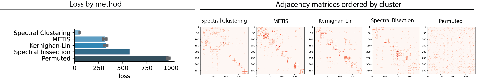
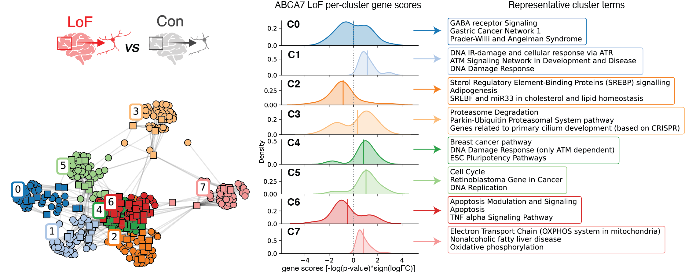
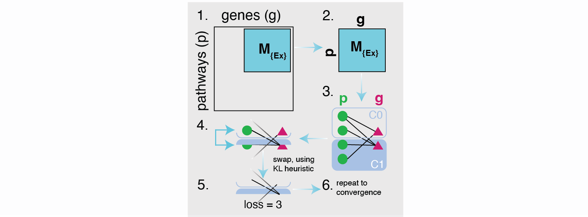

[](https://www.biorxiv.org/content/10.1101/2023.09.05.556135v1)

# geneclusters

Here we implement a graph partitioning algorithm to summarize redundant gene-pathway information as a limited number of non-redundant gene-pathway groups. In this context, we show that the Kernighan-Lin (K/L) algorithm performs similarly to METIS and produces more interpretable clusters compared to other algorithms:



*Left: Average loss (total cut size; see Methods) associated with applying each algorithm (spectral clustering (SC), METIS, Kernighan-Lin (K/L), spectral bisection (SB), or random permutation) to G (with 379 vertices; see Methods) over 1000 initiations (SC, random permutation) or 5x10e5 initiations (METIS, K/L). The SB implementation is deterministic and was run only once. Error bars indicate the standard deviation. Right: Unweighted adjacency matrix for G sorted by labels assigned by indicated algorithm. Red indicates the presence of an edge between two vertices. For each algorithm, labels corresponding to the best initiation (lowest loss) over 1000 initiations (SC, random permutation) or 5x10e5 initiations (METIS, K/L) are shown.* 

In our [paper](https://www.biorxiv.org/content/10.1101/2023.09.05.556135v1) we show how applications of K/L clustering to a biological graph help us summarize an omics dataset in simple non-redundant terms:




## Usage
### Quickstart
```python
# list all genesets
gene_sets = gseapy.get_library_name()
print(gene_sets)
```
	['ARCHS4_Cell-lines', 'ARCHS4_IDG_Coexp', 'ARCHS4_Kinases_Coexp',...]

```python
# run with internet
gene_sets = gseapy.get_library_name()
```

```python
# assign the clusters
mat = get_gene_pathway_matrix(path)
frame, loss_temp = get_kernighan_lin_clusters(path=None, threshold=30, C=0, KL_modified=True, random_labels=True, unweighted=True, seed=5, no_progress=False, mat=mat)
frame.columns = ['cluster', 'description', 'is_gene']
```

```python
# plot graph
s=10000
graph, pos, cur_labels, unique_clusters, colors, layout = get_layout(frame, mat.T, s, 15)
out_path = './'
plot_graph(layout, pos, graph, cur_labels, unique_clusters, colors, out_path)
```
### More examples
see `examples.ipynb` notebook for K/L, METIS, spectral clustering, and spectral bisection implementations, benchmarking, and visualization 

## Algorithms overview

### K/L
[[CMU]](https://www.cs.cmu.edu/~ckingsf/bioinfo-lectures/kernlin.pdf)
[[Wikipedia]](https://en.wikipedia.org/wiki/Kernighan%E2%80%93Lin_algorithm)


## Notes
- It is worth trying a range of algorithms, as the best-performing one might differ based on the specific graph of interest.
- In [our case](https://www.biorxiv.org/content/10.1101/2023.09.05.556135v1), K/L and METIS perform very similarly, but we end up using the K/L algorithm because we found it to perform better on larger graphs.
- KL_modified: we add a slight modification 

## Citation
If you use this code in your work, please cite using the following BibTeX entry:
```
@article{vonMaydell2023,
  doi = {10.1101/2023.09.05.556135},
  url = {https://doi.org/10.1101/2023.09.05.556135},
  year = {2023},
  month = sep,
  publisher = {Cold Spring Harbor Laboratory},
  author = {Djuna von Maydell and Shannon Wright and Julia Maeve Bonner and Ping-Chieh Pao and Gloria Suella Menchaca and Gwyneth Welch and Carles A. Boix and Hansruedi Mathys and Guillaume Leclerc and Noelle Leary and George Samaan and Manolis Kellis and Li-Huei Tsai},
  title = {A single-cell atlas of {ABCA}7 loss-of-function reveals lipid disruptions,  mitochondrial dysfunction and {DNA} damage in neurons}
}
```
## Installation 
`git clone https://github.com/djunamay/geneclusters.git`
and follow the `examples.ipynb`

## Questions?
Please email us: djuna@mit.edu

