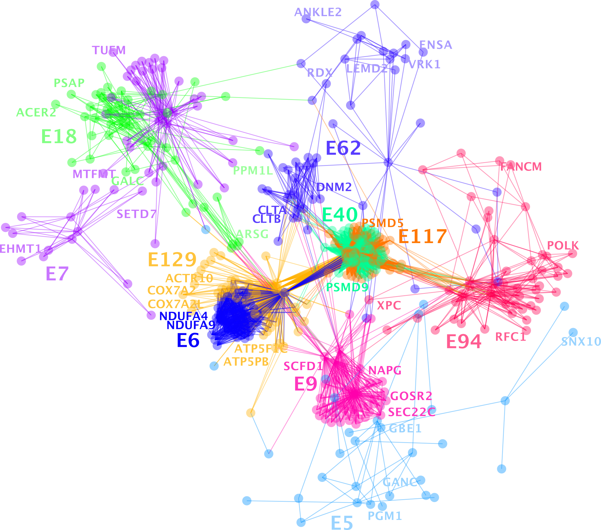

# *genecluster*


### Overview
This package takes as input a dictionary of genesets and returns non-redundant gene clusters, by solving the graph partitioning problem using the Kernighan Lin heuristic. User-adjustable parameters include the confidence parameter ($C$) and threshold parameter ($T$), described below:

$C\in[0,1]$

$T < N$ where $N=|Genes|$

$C$ captures our inverse confidence in negative annotations; Here, we assume two sources for the absence of an edge between a gene and a pathway: (1) the gene is not part of the pathway, (2) the gene and the pathway haven't been studied together. C is the probability that a gene is part of a pathway, given that the edge between gene and pathway is not annotated (think; probability of a false negative).

---

### Quickstart

1. load dependencies


```python
import multiprocessing
import pandas as pd
import numpy as np
import matplotlib.pyplot as plt
import gseapy

from geneclusters.cluster_genes import score_for_thres, get_kernighan_lin_clusters
from geneclusters.prepare_inputs import get_gene_pathway_matrix
from geneclusters.compute_stats import compute_t, compute_permuted_t, return_correlation_matrix, return_permutation_inputs, run_permutations, compute_permutation_p
from geneclusters.plotting import plot_permutations

cpu = multiprocessing.cpu_count()
pool = multiprocessing.Pool(cpu-1)
```

2. download the pathway source on which you'd like to cluster


```python
# run with internet
x = gseapy.get_library('WikiPathway_2021_Human')
np.save('WikiPathway_2021_Human.npy', x)
```

3. run kernighan-lin clustering algorithm 


```python
# assign the clusters
frame = get_kernighan_lin_clusters('./examples/WikiPathway_2021_Human.npy', threshold=50, C=.5)
frame.columns = ['cluster', 'description', 'is_gene']
frame.to_csv('kernighan_clusters.csv', index = False)
```

---
### Kernighan-Lin Heuristic


### Other Sources: 
[CMU](https://www.cs.cmu.edu/~ckingsf/bioinfo-lectures/kernlin.pdf)\
[Wikipedia](https://en.wikipedia.org/wiki/Kernighan%E2%80%93Lin_algorithm)

---

### Visualizing and interpreting clusters
Coming soon...

----
TODOS: https://docs.google.com/document/d/1J4hWWuBwt3cu2HGaCzkejW5mHFVFrVVVMow2A0meU5E/edit?usp=sharing
